# K线训练营

沉浸式模拟交易，快速提升交易盘感
本软件由B站UP主 [pl老李](https://space.bilibili.com/379411619) 独立开发，秉持共享精神，完全免费，无会员体系，无功能限制，致力于为每一位交易者提供高效、专业的模拟训练环境。

## 📱 适用平台
- Windows 10 / 11（桌面端）

- Android（移动端）

- ⬇️ 下载方式
通过网盘分享的文件：k线训练营
链接: https://pan.baidu.com/s/1K3M2649XRhVX4W5pV1E1Dg?pwd=c6ka 提取码: c6ka

## 🎯 核心功能亮点
1. 双模式模拟交易
-   现货模式：适用于A股、加密货币等现货市场的模拟练习。

- 多空杠杆模式：支持带杠杆的多空双向交易模拟，最高可模拟200倍杠杆，体验合约交易场景。

2. 历史行情深度回放
- 可选择任意日期、任意品种的K线数据进行步进式回放。

- 支持“上一根K线”反复练习，可对一段行情进行深度研究与复盘。

- 随时查看历史交易记录与复盘数据，积累实战经验。

3. 专业分析工具集成
- 画线工具：文字标注、趋势线、水平线、线段、折线、箭头、矩形、黄金分割线、多空标识等。

- 技术指标：支持MA、EMA、BOLL、成交量、MACD、KDJ、RSI、WR、高斯核回归、超级趋势、POB订单块、MSB订单块、缠论等丰富指标。

4. 灵活数据与操作
- 支持导入CSV格式历史数据，自定义训练品种。

- 提供市价单、限价单、突破单等多种订单类型，贴近真实交易。

- 存档功能可随时保存进度，下次从退出位置继续训练。

5. 个性化使用体验
- 图表支持黑色/白色主题切换，适应不同视觉偏好。

- Windows版支持快捷键操作，提升模拟效率。


# 软件操作
## 只做多 和 多空模式：
- 只做多模式：无任何的杠杠，不能做空，只能做多
- 多空模式：支持做多和做空的复盘，杠杠倍数可选，最大200x杠杠
- 两个模式都有以下三个选择模式：
- 1. 复盘模式：自由的选择需要要复盘的币种、股票，任意的选择指定的日期
- 2. 随机模式：随机的任意的选取一个品种的k线来进行回放复盘
- 3. 裸K模式：随机的选取一段K线进行复盘，未知价格、未知时间、未知品种

## 复盘配置操作：
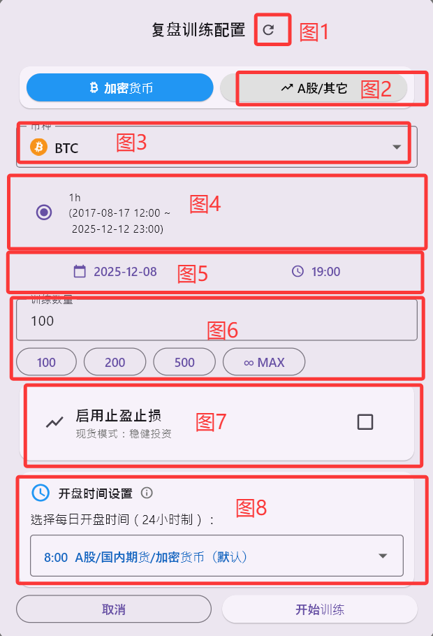
1. 图1刷新：用来清除无效或者恢复数据，例如：windows重新安装后，以下载的数据丢失，使用刷新可恢复
2. 图2：导入的数据以及A股的数据
3. 图3：品种名称选择
4. 图4：时间周期：k线源数据，分钟：m   小时：h   天：d（最大支持天）
5. 图5：时间选择：选定一个复盘开始的时间周期
6. 图6：复盘的k线数量：输入框输入数量，MAX表示从图5选择的时间到最新的时间
7. 图7：启用止盈止损：开仓后自动设置止盈止损，无需手动设置
8. 图8：开盘时间选择：影响多周期的识别，图4是天以下的生效，对于加密货币、A股保持默认即可

## 交易操作：
1. 全仓模式：以当前最新价把所有的可用余额一次性买入
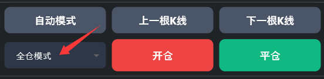
2. 市价单模式：可以输入仓位进行分仓管理，根据当前的最新价成交

3. 限价单：挂单成交，只有价格达到挂单的位置才会成交
4. 突破单：挂单成交，只有价格突破价格才会成交
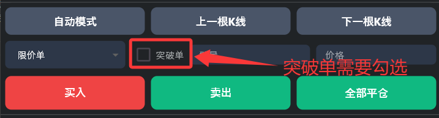
5. 止盈止损设置：开仓后，在下方的仓位信息的右上角设置  
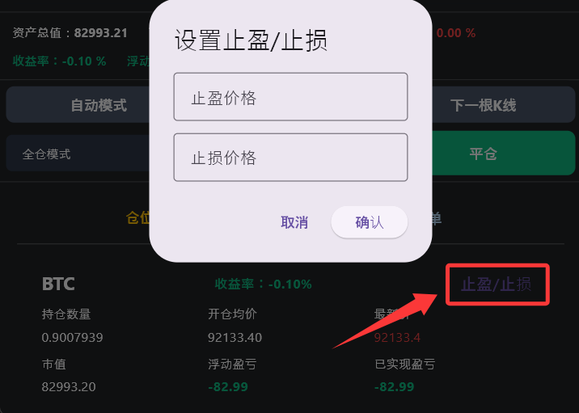
7. 撤销挂单：撤销止盈止损以及挂单
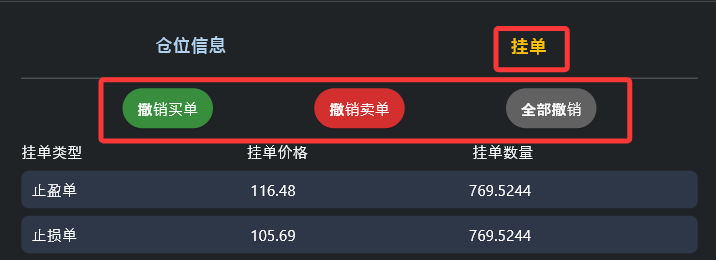

## 画线操作使用
- 手机版：选择需要画线的类型后第一次点击屏幕为起点，第二次点击屏幕为终点
- windows版：第一次选择起点，二次点击确定终点，鼠标右键取消当前画线
- 拖动画线某个点：每一个画好的线，第一次点击控制点为选择，第二次长按控制点可进行拖动
- 整体拖动画线：和拖动的操作步骤一样
- 1. 折线操作：首次点击确定起点，后续的点击为添加终点，双击屏幕完成折线的绘制，折线可以保存为模版，也可以从模版加载
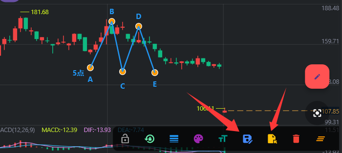


# 图表基础设置：
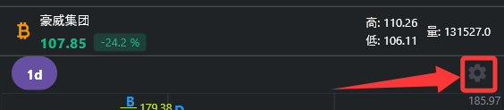
## k线推进模式：
- 使用源K线推进：点击下一根和上一根K线只会在源K线进行推进，例如源K线为5分钟数据，切换周期到1天，每次点击下一根K线，只会增加5分钟的K线
- 按照周期推进：点击下一根和上一根K线会根据当前选择的K线周期来进行推进
- 自动模式深度：设置自动播放K线的速度（只在使用源K线推进生效）
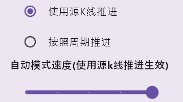

## 图表信息设置：
- 显示买卖标志：开仓以及平仓在图表显示S/B标志
- 显示开始标志：在复盘开始的K线显示一个垂直的透明标志，标记本局训练从那一根k线开始
- 显示计数器：在顶部的位置计数当前训练的k线数量
- 显示开仓平仓线：开仓平仓后在图表显示开仓和平仓的位置，以及盈亏比
- 显示止盈止损线：如果设置了止盈止损，开仓后在图表绘制出来
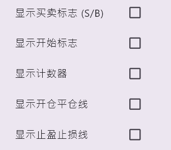

# k线数据下载、导入、删除：
## 下载数据
软件自带的数据只有比特币以及以太坊的数据，如果需要复盘A股或者其它币种的数据，可自行进行下载
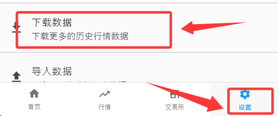
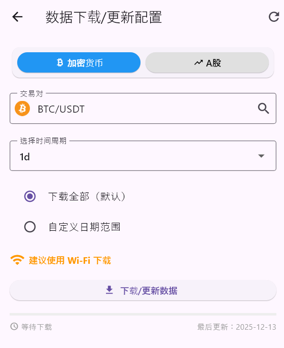

## 加密货币无法联网处理方法：
- 下载加密货币的k线数据需要VPN代理
- 不支持加拿大、美国的节点，如果代理节点是美国加拿大的，需要切换到其它地方
- 在软件的设置里面把代理改成和你代理工具一样的代理IP
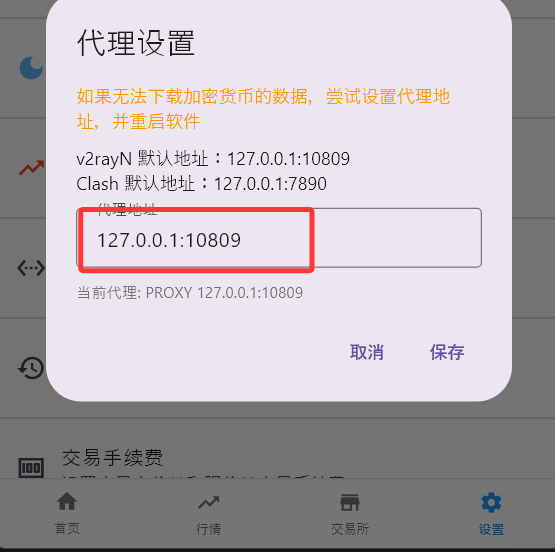

## 导入数据
数据的导入格式仅支持.csv文件导入  
没表头的数据都是按照：时间、开盘价、最高价、最低价、收盘价、成交量 的格式导入
有表头的数据的时间格式的支持：
```
秒的时间戳 
2025-09-21 06:30:00
2021-1-14
2021.01.01 00:00
2025.11.06 05
2025/11/21-13:40
```
```
不支持的时间格式：
2025-09-21,06:30:00  （日期后面加入 , 的格式不支持）  
```
对于导入的数据可能会发生的异常，画线跳动，k线错乱等，对于导入的数据时间异常就会出现异常，软件的大部分对于画线以及多周期的K线合成都是基于时间戳
### 📝 数据导入示例
软件支持导入CSV格式的历史数据：

```csv
时间,开盘价,最高价,最低价,收盘价,成交量
2024-01-01 09:30,100.00,102.50,99.50,101.00,10000
2024-01-01 10:30,101.00,103.00,100.50,102.50,12000
```
```
timestamp,open,high,low,close,volume
1493827200,10.11,10.11,10.11,10.11,149.0
1493913600,11.12,11.12,11.12,11.12,51.0
```

## 删除以及下载到本地的数据
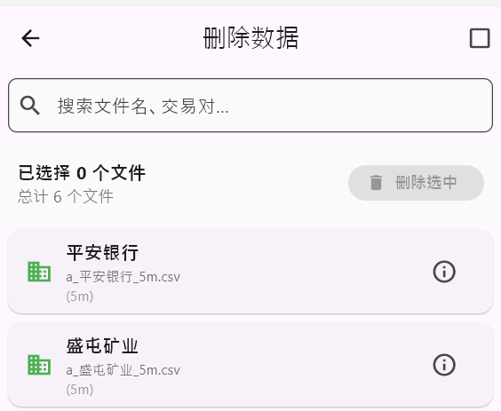  
对于不想要的数据，在设置找到删除数据，选中对应的数据即可删除

## 设置历史K线的数量
历史K线的数量，即进行复盘的时候图表加载的K线数量，软件默认是350根，需要修改在设置找到“图表初始K线数量”进行设置(需要数据足够的多)

# 支持作者更新
💝 支持作者
### 💰 加密货币交易所推荐
通过以下链接注册，您将享受优惠费率，同时作者也能获得少许返佣支持：

🪙 [币安 (Binance)](https://bn1688.cc/bn1688)  
邀请码: BN528

注册链接: https://bn1688.cc/bn1688

特点: 全球最大的加密货币交易所，币种齐全，流动性好

🔶 [欧易 (OKX)](https://bn1688.cc/okx)  
邀请码: 9398564

注册链接: https://bn1688.cc/okx

特点: 功能全面的综合交易平台，产品线丰富

🧡 [火币 (HTX)](https://bn1688.cc/htx)  
邀请码: cznxb223

注册链接: https://bn1688.cc/htx

特点: 老牌交易所，安全稳定，操作简便

🚪 [芝麻开门 (Gate.io)](https://bn1688.cc/gate)  
邀请码: JMLAOLIA

注册链接: https://bn1688.cc/gate

特点: 可享64%高返佣（注册后私信博主UID开通）

💼 [Bitget](https://bn1688.cc/bg1688)  
邀请码: cg5z

注册链接: https://bn1688.cc/bg1688

特点: 合约交易体验优秀，产品创新

### 🌟 黄金外汇平台推荐
🌐 [Exness](https://bn1688.cc/exness)
注册链接: https://bn1688.cc/exness

特点: 专业外汇黄金交易平台，低点差，高杠杆，监管严格

🙏 支持方式说明
通过上方链接注册 - 您在享受交易服务的同时，作者也能获得少许佣金支持

无需额外付费 - 注册和使用交易所服务与直接注册完全相同

更高返佣优惠 - 特别是芝麻开门，注册后私信博主UID可开通64%高返佣

双赢支持 - 您获得优惠费率，作者获得持续开发的动力

⚠️ 风险提示
数字货币和外汇交易具有高风险，价格波动剧烈，可能导致本金损失。
建议：

充分了解相关风险

根据自身风险承受能力谨慎参与

先使用本K线训练营软件进行充分的模拟训练

小额试水，逐步积累经验

您的每一个注册支持，都是作者持续更新和维护软件的动力！感谢支持！ 🚀
 

## 加入社区
 
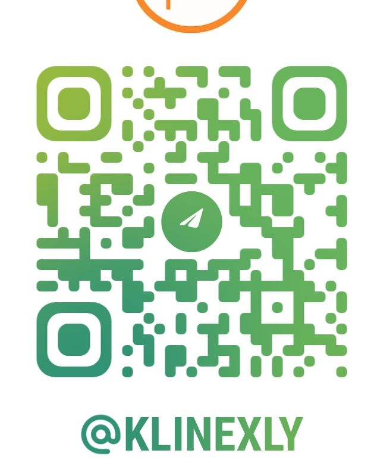 
[QQ群](http://qm.qq.com/cgi-bin/qm/qr?_wv=1027&k=beAx0ifdQbkiJ0HzAk2YDZVdBZEu90cW&authKey=Z5k6HcwNiGq4Mgt%2BGtLeGQHTctaj%2F0XuGI9zyNEWJYgtKqG3HTRBhJZ%2Bg2by%2Bgt2&noverify=0&group_code=881400607)  
[电报交流群](https://t.me/klinexly)


👨‍💻 开发者信息
作者：pl老李

B站主页：https://space.bilibili.com/379411619

YouTube频道：https://www.youtube.com/channel/UC7mbUJxwZ95_FmjF6fzc--A

💡 通过反复训练，培养盘感，精进技巧——K线训练营，助你在真实交易前做好充分准备。

软件持续更新，如有建议或反馈，欢迎通过作者B站或YouTube频道联系。