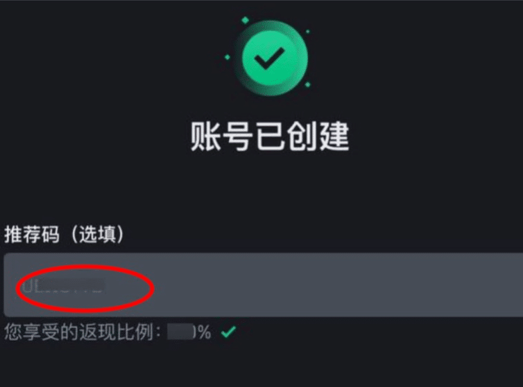
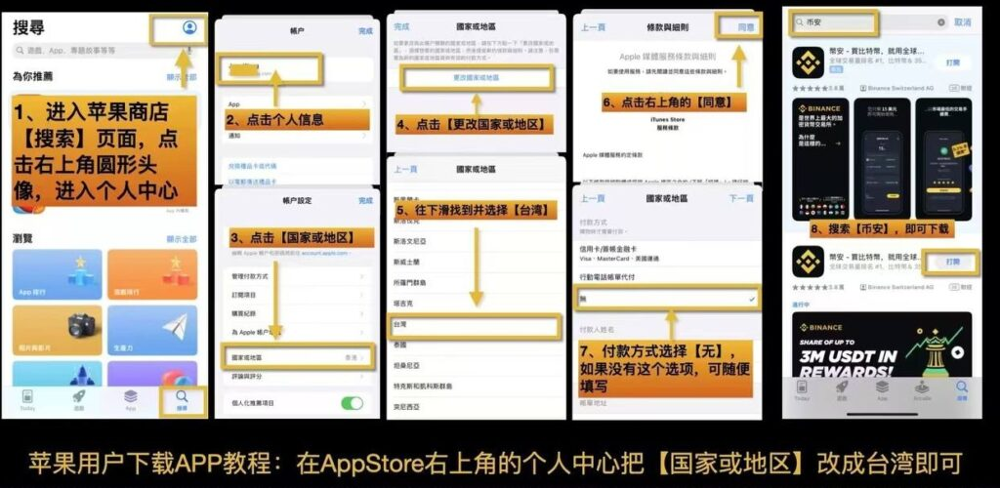

# 2026年Binance币安注册及KYC实名认证教程

## ⚠️ 2026年中国大陆用户注册币安重要提示 #
作为全球领先的数字资产平台，新用户完成币安注册和身份认证是交易的第一步。本文将详细解析流程，助您快速上手，顺利进入加密世界。

1. 能注册吗？ 100%可以。币安未清退中国用户，支持中国身份证实名认证（KYC）。

2. 核心障碍： 最大的问题是网络IP和App下载。注册过程开启VPN（全局模式），务必使用台湾节点，不要用美国和加拿大节点。

#### 本文章的配套视频教程：
1. 币安注册认证视频教程：[iphone | ios |苹果手机如何注册下载币安交易所！并且进行KYC认证](https://www.youtube.com/shorts/csKq4OqEmNw)
2. 币安C2C交易视频教程：[USDT如何购买？币安Binance注册买币教程。微信、银行卡、支付宝](https://www.youtube.com/shorts/csKq4OqEmNw)  

   
### 第一步：获取注册链接与邀请码 #
👉 专属优惠注册链接（推荐台湾IP打开）：
https://www.binance.com/zh-CN/join?ref=BN528
（如果没有VPN，推荐使用快连，亲测稳定）
### [立即注册币安](https://bn1688.cc/bn1688)

备用方案： 如果在App内注册，必须在注册完成页手动输入推荐码 BN528 手续费优惠才能生效，没实名前可以在APP内联系客服补填！

### 第二步：中国大陆注册要点（避坑指南） #
为了避免被误导，大陆用户请严格按照以下标准操作：

1、网络环境（IP）：
切记避开美国、加拿大和荷兰，这些地区被禁止访问。最稳妥的方案是使用台湾节点。如果提示无法服务，请切换节点并刷新页面。

2、手机号和邮箱：
支持+86手机号直接注册，或者用你喜欢的gmail等邮箱。  

### 第三步：币安详细注册流程（图文）#
所需时间： 3 分钟

2025年中国大陆用户注册币安Binance详细图文教程  
1. 点击注册链接进入官网
（确保VPN已开启）
点击本站专属链接 https://www.binance.com/zh-CN/join?ref=BN528 进入注册页。
推荐使用邮箱或手机号注册。再次提醒：如果提示IP受限，请将VPN切换至台湾节点。

2. 填写账号信息（支持+86手机号）
输入你的邮箱或手机号。如果是手机号，找到“+86”区号。
勾选“我已阅读并同意币安的服务条款”，点击下一步。

3. 输入验证码
查看手机短信或邮箱收到的6位验证码并输入。如果没收到，请检查垃圾邮件箱，或等待60秒后重试。

4. 设置强密码
设置一个强密码：至少8位，包含至少1个数字和1个大写字母。

5. 最后确认：检查邀请码BN528
注册完成前，务必检查界面显示的“推荐码”是否为 BN528。显示此码代表你已激活终身20%手续费返现。
点击“提交”完成注册。之后系统会引导你下载App进行身份认证。

### 第四步：App下载与身份认证（KYC）#
1. 下载币安App（解决大陆下载难）：
安卓用户： 不要去应用商店搜！请直接点击这里下载币安官方APK安装包。

苹果用户（iOS）： 中国大陆Apple ID无法搜索到Binance，美国Apple ID只能搜到美国阉割版Binance US。你需要一个“台湾区Apple ID”。
你可以通过自助注册或者直接购买成品号：[账号星球](https://accboyllafx.acceboy.com/)

2. 身份认证（KYC）实操：

下载App登录后，出于反洗钱要求必须进行身份认证才能交易。请点击App首页的“去认证”。

关键点： 必须使用中国大陆身份证。认证时国籍选择“China（中国）”，选错了找客服改。上传身份证正反面并进行人脸识别，通常1小时内审核通过。

### 第五步：账户安全设置（2FA）
为了资金安全，强烈建议绑定“谷歌验证器（Google Authenticator）”或“币安验证器”。

原理说明：
币安会给你一个16位密钥，你把它输入在验证器App里完成匹配绑定，它会每分钟生成一个动态6位数字。以后登录或提现时，必须输入这个动态数字。

常见错误：
如果绑定时候提示“2FA错误”，通常是因为你现在的验证器使用的密钥不是币安最新的，或者手机时间未同步。建议移除旧的验证码序列，重新走一遍绑定流程。

绑定验证器能极大提升账户安全性

### 第六步：新手购买USDT
在首页点击c2c买币就可以通过c2c购买usdt，里面的商家类似于淘宝的商家，平台相当于担保方  
新人推荐买10usdt到100usdt，可以先尝试适不适合这个市场

#### 油管完整的视频： [USDT如何购买？币安Binance注册买币教程。微信、银行卡、支付宝（小荷包）](https://www.youtube.com/shorts/csKq4OqEmNw)