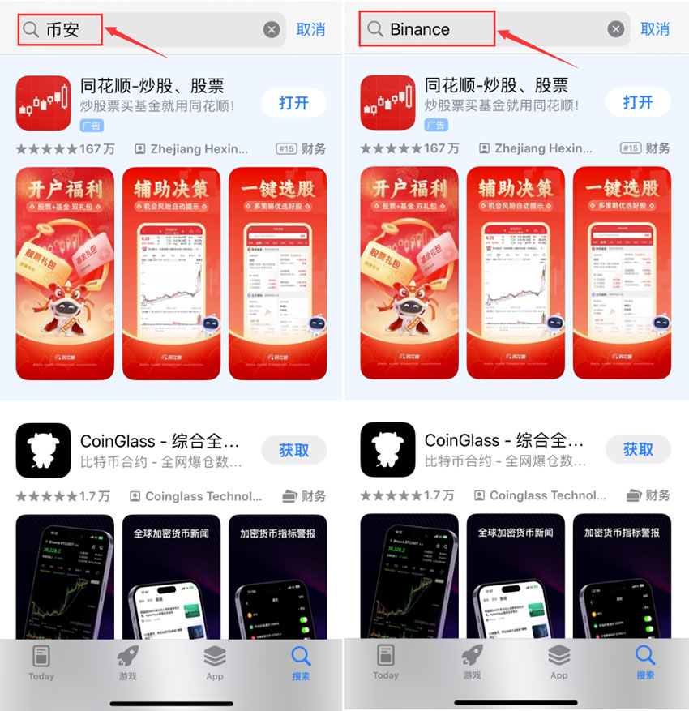
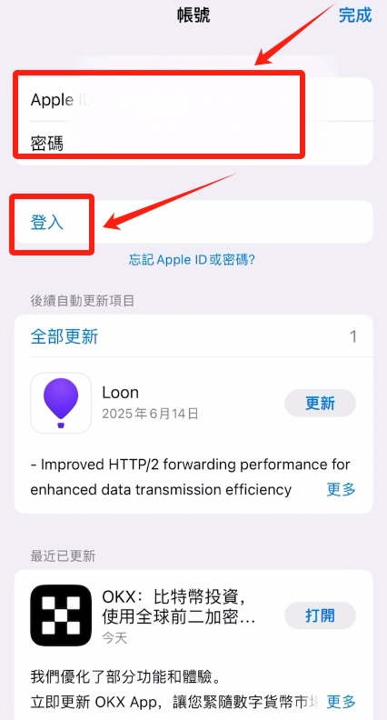
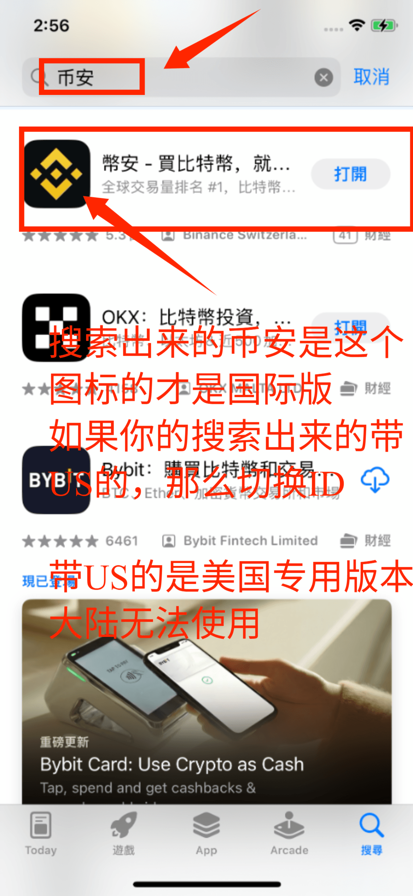

import BinanceCard from '@/components/BinanceCard.astro';

    

        <strong style="color: #000; font-size: 18px;">欧易（OKX）</strong> 作为全球领先的加密货币交易所之一，以其丰富的币种、强大的功能和良好的流动性吸引了大量用户。然而，对于广大的苹果 <strong>iPhone</strong> 用户而言，下载和安装欧易 App 却成了一个不小的难题。本文将为您提供一份详尽、安全、一步步的下载流程指南，需要的朋友可以参考下。
    

在数字资产日益普及的时代，欧易（OKX）已成为众多用户信赖的平台。然而，许多国内苹果用户常常面临无法在 App Store 搜索到“币安”App 的困扰。这篇文章将详细介绍如何在IOS苹果手机上成功下载安装币安App，中国大陆用户可以参考学习一下。

# 一、币安（Binance）是什么？为什么选择币安交易？

币安（Binance）成立于2017年，由赵长鹏（CZ）创立，是目前**全球交易量排名第一**的加密货币交易平台。它为全球用户提供包括现货交易、合约交易（U本位/币本位）、期权交易、杠杆交易、C2C 法币交易以及理财等多种加密产品，并支持数百种数字货币及其交易对。凭借其行业第一的盘口深度、极高的流动性和持续创新的 Web3 生态系统，币安在全球范围内吸引了数以亿计的加密资产投资者。

币安的核心优势包括：

* **交易费率极低：** 币安提供全网极具竞争力的基础交易费率（现货标准费率仅为 0.1%），并且用户通过开启使用平台币 **BNB** 抵扣手续费，可以进一步享受**现货 25%、合约 10%** 的手续费专属折扣。

* **丰富的交易品种与生态：** 平台支持超过 350 种主流及热门优质加密货币（如比特币 BTC、以太坊 ETH、SOL 等），同时提供完善的衍生品交易（永续合约、交割合约）、量化跟单机器人，以及无缝接入的 Binance Web3 钱包。

* **顶级的安全保障：** 币安采用严格的资金管理标准，大部分用户资产存储在多重签名的冷钱包中。平台不仅支持谷歌双重身份验证（2FA）、通行密钥（Passkeys）等高级账户防伪手段，还设立了规模庞大的**“用户安全资产基金（SAFU）”**来兜底突发极端黑客风险，确保用户资金的绝对安全。

* **全球化与极高流动性：** 作为行业绝对的龙头，币安拥有极佳的买卖盘口深度，即使是大额交易也能做到极低滑点。平台支持数十种语言和多国法币的 C2C 交易通道，无论你是刚入门的新手还是专业的量化机构，都能获得顺滑的交易体验。
<BinanceCard />

# 二、为什么国内App Store搜不到欧易OKX？
由于政策原因，地区的Apple ID默认屏蔽了某些相关App，包括OKX欧易。

因此，国内用户需要通过一些方法才能顺利下载安装：

# 三、准备工作
由于国内的政策原因，默认是屏蔽了加密货币相关的APP，因此你需要重新注册一个海外的Apple ID来进行下载  【推荐：中国台湾 ，切记下载币安不要使用美国的ID进行下载，美国ID搜索出来的为美国专用版本，大陆无法使用】
- 海外苹果ID注册教程：[【2025 Apple ID最新注册教程，无需信用卡，大陆手机号、一次成功】](https://www.bilibili.com/video/BV1fzSEBGEen/?share_source=copy_web&vd_source=da8d06430c55e31ec1a52eec07c6fd06)

- 如果注册不成功，可以直接购买成品ID：[账号星球](https://accboyllafx.acceboy.com/) 

#### 注意：不建议在网上找共享ID进行下载，有锁机的风险！

# 四、手机AppStore登录Apple ID
海外的Apple ID注册/购买成功后，打开Appstore，在右上角点击我们的头像。把我们原来中国大陆的Apple ID退出登录，因为它是搜不到币安APP的。

往下捯，点击【登出】。

然后我们再输入进我们购买好的台区的apple ID和密码，点击【登入】。

# 五、在AppStore里搜索币安并下载
登录成功之后，这样就可以在AppStore里搜到币安和欧易APP了。

### 拓展教程：
1. ### 币安开户教程：
   - #### 图文教程：[币安 (Binance) 2026年最新注册与实名认证操作步骤教程](/posts/binance-register-tutorial-2026-02-27/)
   - #### 视频教程：[这里写视频标题](视频链接)

2. ### 币安c2c买卖usdt：
   -  #### 图文教程：[2026年如何安全购买加密货币？币安交易所C2C买币的全面指南](/posts/binance-c2c-buy-crypto-guide-2026/)
   - #### 视频教程：[这里写视频标题](视频链接)

3. ### 币安现货与合约交易
   - #### 图文教程：[如何在币安交易所进行现货（币币）| 合约交易？2026最新教学](/posts/binance-spot-and-futures-trading-tutorial-2026/)
   - #### 视频教程： [这里写视频标题](视频链接)

# 如何识别官方正版币安 (Binance) App？

* **名称：** Binance（认准纯英文，无其他后缀）
* **开发商：** Binance Switzerland AG（或显示为 Binance 官方）
* **图标：** 经典的黄黑配色币安 Logo
* **网址说明：** 官方注册地址为 [https://www.binance.com](https://bn1688.cc/bian)

    

        <strong>⚠️ 美区 Apple ID 用户超级避坑警告：</strong> 
        如果你使用的是<strong>美区 ID</strong>，在 App Store 搜索 "Binance" 时，排在第一位的极有可能是 <strong>「Binance.US」</strong>（图标上带有明显的 "US" 字样）。  
        <strong>请千万不要下载这个版本！</strong>这是币安专为美国本土用户开发的独立合规版，<strong>不支持中国大陆用户注册，也绝对无法使用大陆身份证通过实名认证（KYC）</strong>。  
        <strong>✅ 正确做法：</strong>强烈建议直接<strong>切换使用日本或中国台湾地区的 Apple ID</strong> 登录 App Store。在这些地区的商店搜索，出来的直接就是纯正黄黑配色图标的 <strong>「Binance」国际版</strong> App，下载后即可顺利使用大陆身份完成开户认证。
    

# 常见问题解答
Q1：我改了区域还是搜索不到？

A：请确认是否已退出并重新登录 Apple ID，有时需重启 App Store。

Q2：海外 ID 没有信用卡怎么办？

A：可选择“无”付款方式，或者使用地址。

Q3：欧易是否安全？

A：欧易是全球合规平台，拥有1:1储备审计，资产安全有保障。

# 总结
如果你正在寻找“如何下载欧易App”或“iOS版OKX下载方法”，这篇指南可以帮助你快速掌握下载技巧。通过修改区域或创建新 ID，就能顺利在iPhone或iPad上获取欧易官方App，开启你的加资之旅。

以上就是欧易苹果版APP如何下载？欧易iOS最新版APP下载教程的详细内容，

