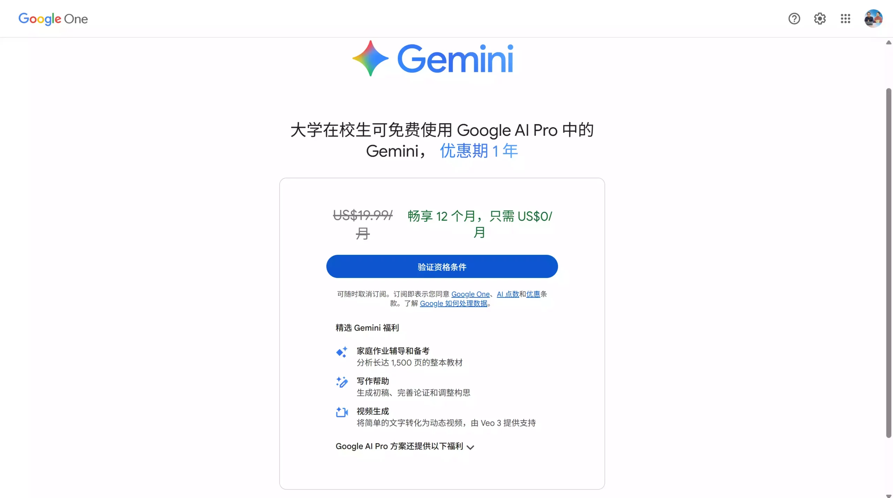
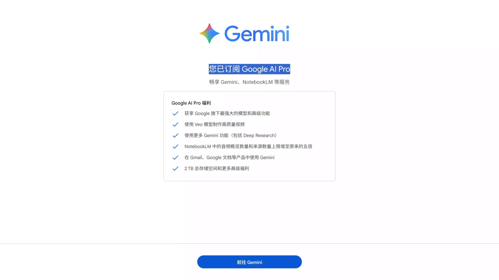
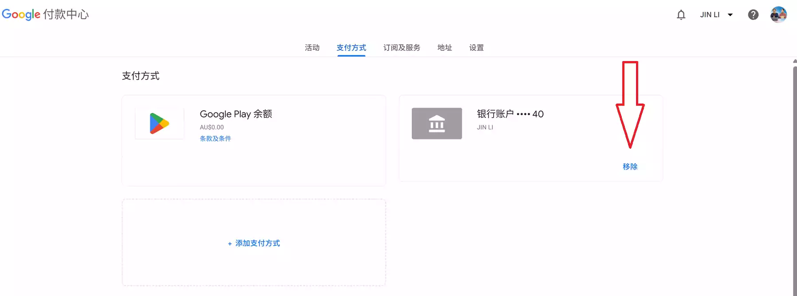
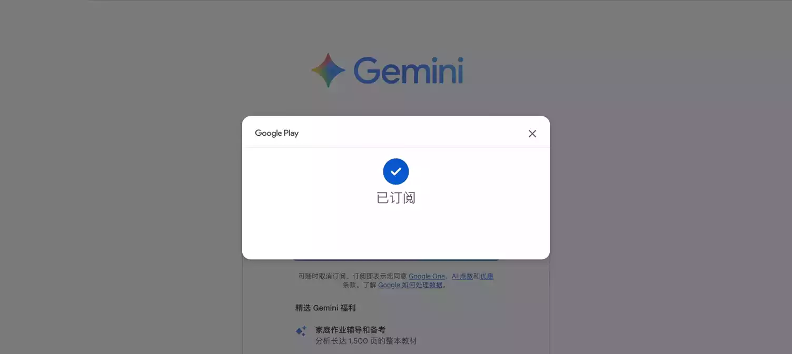

## 视频教程：
- Youtube视频教程 ：[免费领 1 年 Google Gemini AI Pro！无需实体信用卡、解决身份认证、学生套餐免费订阅12个月Pro全流程]()

- Bilibili视频教程：[免费领 1 年 Google Gemini AI Pro！无需实体信用卡、解决身份认证、学生套餐免费订阅12个月Pro全流程]()

- Gemini学生会员成品账号（12个月）：[直接购买](https://accboyllafx.acceboy.com)

今天我们来说下如何免费获取1年的Google Gemini AI Pro学生套餐，适合写作、学习、创作全流程提效，完全零成本体验顶级AI。



## 1、前期准备工作：

- **Google账号**（估计大家都有，没有的可以点击这里[购买账号](https://accboyllafx.acceboy.com)）
- **代理节点**：澳大利亚、台湾、新加坡、日本、马来西亚等
- **Telegram账号（没有的可以点击购买[立即购买](https://accboyllafx.acceboy.com) ）**
- **虚拟信用卡或国际信用卡**（没有的点击[立即开通虚拟信用卡](/posts/crypto/bitget-card/test-bitget-card/)）



## 2、免费获取步骤：

### 第一步：开启代理
使用【免费的VPN】或【收费的VPN】都可以，节点推荐使用：澳大利亚、台湾、新加坡、日本、马来西亚的IP节点！当然你可以自建，肉身在海外的可以直接使用自己网络即可！

### 第二步：清理支付账号
取消谷歌账号之前绑定过的支付账号，否则会提示你无权开通；如果可以，强烈建议注册一个新的Google账号！

在谷歌账号的个人中心，找到支付方式，去除里面的支付账号：




### 第三步：学生认证
进入[学生认证页面](https://gemini.google/students/)，并下载安装Telegram来获取学生认证ID：

点击进入TG：【[机器人](https://t.me/sheeridverifier_bot)】

添加机器人后会加入到TG群组中，使用下方的命令来进行验证ID：

```bash
/verify 后面跟上你的验证链接
```
注意：进入机器人后要先执行命令 /checkin 来领取金币，否则会提示余额不够！

## 第四步：准备虚拟信用卡
准备一个虚拟信用卡【（没有的点击[立即开通虚拟信用卡](/posts/crypto/bitget-card/test-bitget-card/)）】

当然你也可以使用实体信用卡，注意：国内的部分信用卡可能会被扣1~5元用于验证，一般1周内会退回。

### 第五步：地址生成
进入[地址生成器](https://www.meiguodizhi.com/)

最后绑定开通即可！就可以免费获取12个月的Google Gemini AI Pro学生高级套餐，到期前记得取消就行。或者开通成功后可以直接取消订阅，不会影响套餐使用，直到明年的12月3号。



3、开通后你能得到什么？
📚 学习必备功能
家庭作业辅导、考试备考

阅读与分析整本教材（最长可达1500页）

写作助手：生成初稿、润色结构、优化逻辑

🎬 AI视频创作
支持Veo 3：输入一句话即可自动生成动态视频

使用Whisk Animate：将图片转换为动画视频片段

🛠️ 更多Google AI工具
NotebookLM（增强版）

音频摘要与知识来源配额提升5倍

Gmail、Google文档等全面接入Gemini

自动写信、整理资料、生成图文内容

💾 大容量存储
2TB Google One高级存储空间（云端硬盘/相册/Gmail共享）

⭐ Pro高级权益
更多扩展功能

专属折扣福利

持续更新的AI创新功能抢先使用

4、常见问题
Q: 非学生可以申请吗？
A: 本教程针对学生认证，但验证流程相对宽松，非学生用户也可以尝试。

Q: 到期后会被自动扣费吗？
A: 建议等到明年12月份前取消订阅

Q: 需要真实的学校邮箱吗？
A: 不需要，通过Telegram机器人验证即可。

Q: 套餐可以多人共享吗？
A: 一个账号只能一人使用，但可以创建家庭组分享部分权益。

更新时间：2025年12月3日
适用地区：支持澳大利亚、台湾、新加坡、日本、马来西亚等地区
有效期：开通后12个月内有效