import BinanceCard from '@/components/BinanceCard.astro';

    

        币安（Binance）作为目前全球交易量排名第一的数字资产交易所，其平台币BNB不仅可抵扣手续费，也是币安智能链的核心燃料,本文提供币安(Binance)2026年1月最新的账号注册与实名认证（KYC）详细操作指南，主要包括APP端流程、注册前材料准备、常见问题及安全建议。
    

币安由赵长鹏（CZ）于 2017 年在上海创立，自带中国基因。受政策影响，它曾开启“全球流浪模式”，辗转日本、马耳他、新加坡等地。如今，在现任 CEO Richard Teng 的带领下，币安已在阿联酋建立了稳固中心，并持有全球多国合规牌照。作为全球交易量最大的平台，其平台币 BNB 不仅可抵扣手续费，也是币安智能链的核心燃料。

本文提供币安(Binance)2026年1月最新的账号注册与实名认证（KYC）详细操作指南，主要包括APP端流程、注册前材料准备、常见问题及安全建议，帮助新手快速完成账户开通。

# 本文章的配套教程：
1. ### 币安开户教程：
   - #### 视频教程：[这里写视频标题](视频链接)

2. ### 币安c2c买卖usdt：
   -  #### 图文教程：[2026年如何安全购买加密货币？币安交易所C2C买币的全面指南](/posts/binance-c2c-buy-crypto-guide-2026/)
   - #### 视频教程：[这里写视频标题](视频链接)

3. ### 币安现货与合约交易
   - #### 图文教程：[如何在币安交易所进行现货（币币）| 合约交易？2026最新教学](/posts/binance-spot-and-futures-trading-tutorial-2026/)
   - #### 视频教程： [这里写视频标题](视频链接)

# 一、注册认证前准备工作
| 准备项 | 具体要求 |
| :--- | :--- |
| **设备** | 安卓 / iOS 手机 (推荐 APP 操作) 或电脑 (网页版) |
| **个人证件** | 中国大陆居民需准备二代身份证(正反面清晰照片)；非中国大陆居民准备护照 / 驾照等官方证件 |
| **个人信息** | 真实姓名、出生日期、国籍、居住地址等 (需与证件一致) |
| **联系方式** | 可用手机号 (接收验证码)、邮箱 (账户找回 / 通知) |
| **安全设置** | 准备强密码 (≥12 位，含大小写字母、数字、特殊字符) |

    

        <strong>⚠️ 重要提示：</strong>币安对中国大陆用户的服务政策可能随时调整，请在注册前确认平台当前服务条款与合规要求。
    

# 二、币安 APP 下载安装 (推荐)
1. 官方渠道下载

  - 安卓用户：访问[币安官网](https://bn1688.cc/bian)，在首页底部找到 "APP 下载"，选择安卓版本；
  不要从第三方应用商店下载，避免安装恶意软件。

  - iOS 用户：需使用海外 Apple ID 登录 App Store，搜索 "Binance" 下载官方应用。

2. 安装设置

 - 安卓用户：安装时需开启 "允许安装未知来源应用" 权限 (根据系统提示操作)。
 - 安装完成后，打开 APP 并同意用户协议。

#### 参考教程：

[币安(Binance)APP下载安装流程：一步步教你完成操作]()

[Apple ID最新注册教程，无需信用卡，大陆手机号、一次成功】](https://www.bilibili.com/video/BV1fzSEBGEen/?share_source=copy_web&vd_source=da8d06430c55e31ec1a52eec07c6fd06)

<BinanceCard />

# 三、币安 (Binance) 2026年最新注册与实名认证操作步骤教程
币安App下载安装完成之后，下面就来为大家一步步演示注册与实名认证操作步骤：

## 第一步：创建账户与安全验证
打开币安APP后，找到【注册/登录】。

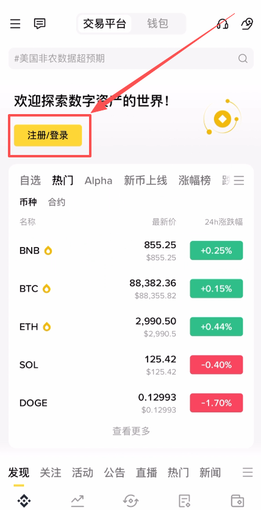

选择【创建币安账户】。

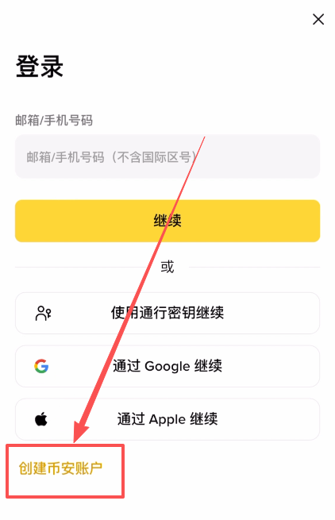

这里我们就可以用邮箱、或者是手机号码来进行注册了。我们可以看到中国+86的手机号也是可以注册币安的。

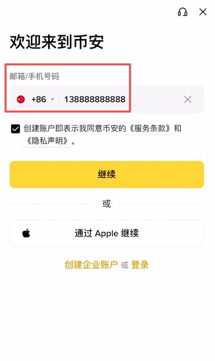

这里我就以邮箱来演示，输入进我们的邮箱，建议大家使用Outlook或者是Gmail等海外邮箱会更加的稳定。当然国内的QQ邮箱或者是163邮箱也是可以的。这里输入进我们的邮箱，勾选同意之后，点击【继续】。

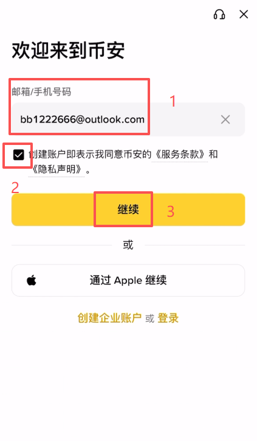

这个时候币安就向我们的邮箱发送了一封验证码，我们回到邮箱查看一下，然后把它输入进来。

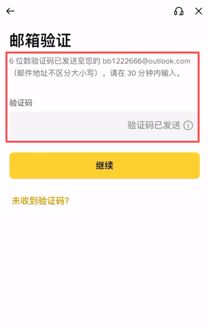

接下来就到了创建密码的部分，我们按照他的要求创建一个8个字符以上，至少包含一个数字，和一个大写字母的密码。点击【继续】。

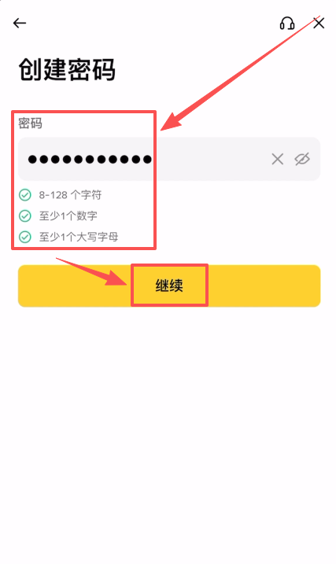

这个时候我们的币安账户就注册成功了，他问我们“您是否有邀请人？”，这里我们一定要选择“有”。然后填写【[BN528](https://bn1688.cc/bian)】，使用这个邀请码进行注册，可以让我们在后续的各种交易中，永久享受20%的手续费的优惠。点击【下一步】。

## 第二步：身份认证(KYC) 流程 (基础认证)
这个时候直接给我们跳转到了身份认证的页面，居住国家或地区，以及证件签发国家或地区这里我们都可以选择“中国”。然后需要我们选择一下我们想要用来认证的证件类型，你是想用身份证、驾照还是护照，我这里就选择“身份证”，点击【继续】。

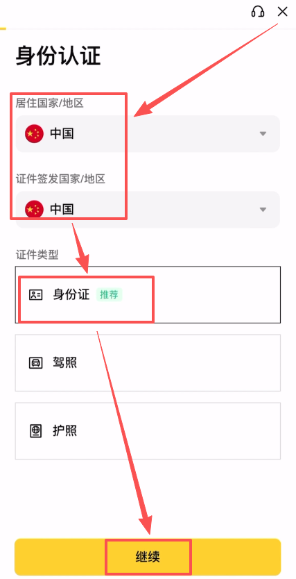

然后需要我们上传或者拍摄一下我们身份证件的正反面，选择上传，点击【继续】。

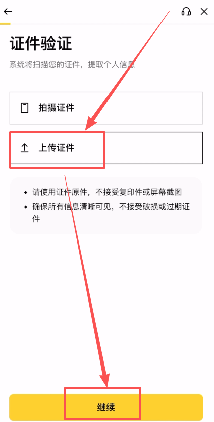

上传好之后点击【继续】。

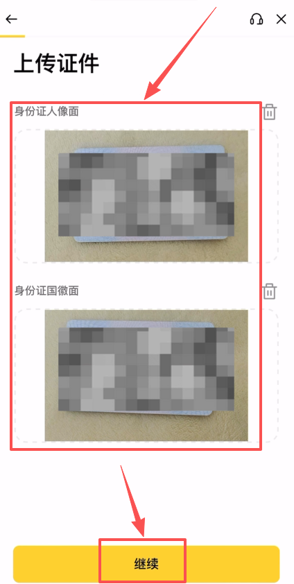

这个时候就到了人脸验证的环节，我们点击【继续】。

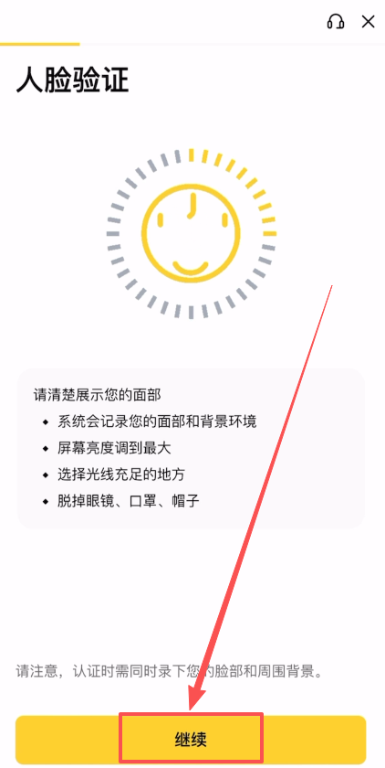

根据要求进行识别。

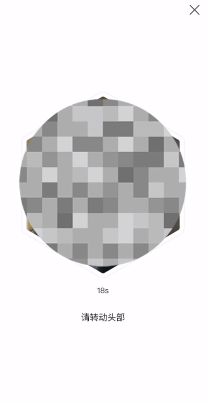

现在就到了最后一步，确认我们的个人信息。注意我们的个人信息一定要是真实的，否则我们的审核是通过不了的。

国籍这里我们是可以选择中国大陆，我们的姓名和出生日期确认没有问题点击【继续】。

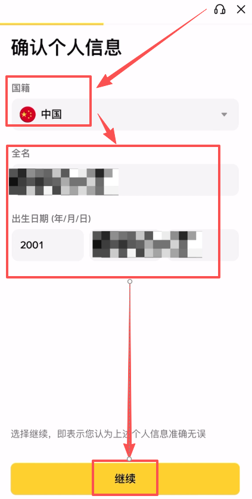

他问我们目前的工作状态是什么，我们直接如实选择就可以了，点击【继续】之后，我们的身份认证就提交审核了，我们等待他审核通过就可以了。

# 第四步：安全设置(推荐，保障账户安全)
 为确保资产安全，建议投资者使用Google Authenticator和Binance Authenticator等应用程序可以显著提高用户的帐户安全性，因为它们需要的不只是密码才能访问。利用通行密钥、安全密钥和多验证器验证等高级工具可以提供额外的安全保障。

定期检查用户的安全设置和账户活动等等，下文是具体介绍：

## 1、身份验证器App(2FA)

像Google Authenticator这样的身份验证器应用可以通过双重身份验证(2FA)为用户的帐户增加一层额外的保护，从而增强帐户安全性。它会生成基于时间的、每 30 秒更改一次的一次性验证码。启用Google Authenticator后，即使有人获得了用户的密码，也能显著降低未经授权访问的风险。

币安身份验证器提供与谷歌身份验证器类似的功能，但它直接集成到币安生态系统中，提供无缝保护。它专为交易者设计，为用户的交易活动提供可靠的双因素身份验证 (2FA)，确保每笔交易安全无虞。

币安身份验证器App设置操作步骤如下：

1. 打开币安app首页，点击左上角币安小图标。
   

2.然后点击用户后面的小箭头。

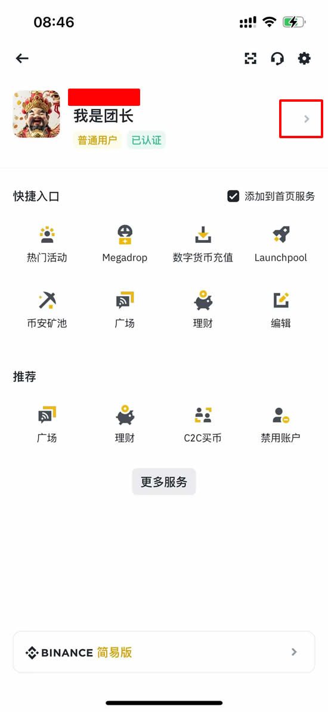

3.点击【账户安全】。

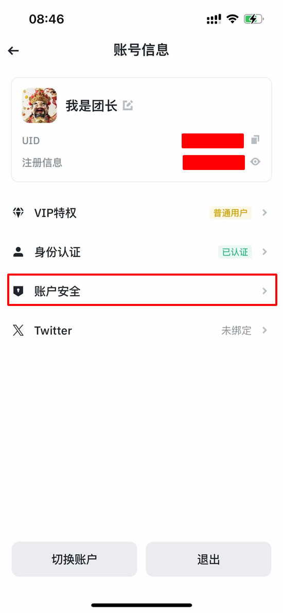

4.在账户安全里，点击【身份验证器App】

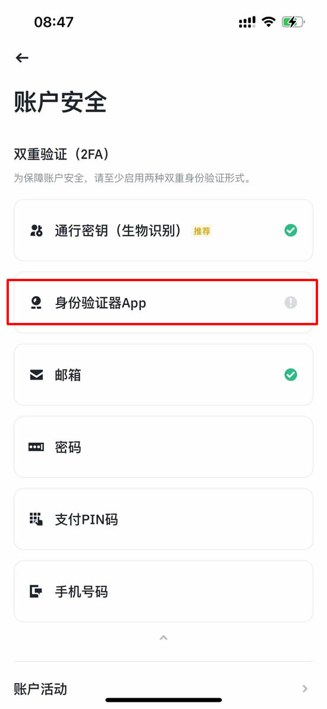

5.确保您已经在手机上安装了 Binance Authenticator APP后，点击[启用]。

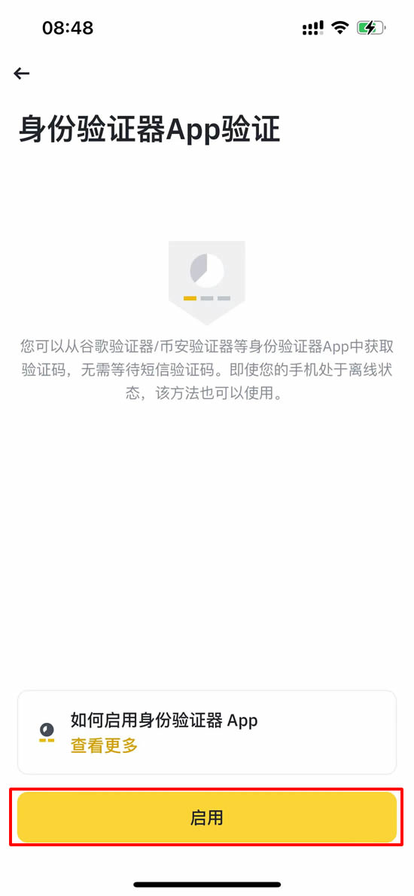

6. 然后您将在屏幕上看到一个 16 位密钥。请将此密钥保存在安全的地方。如果您丢失了设备，此密钥将允许您恢复您的 Binance Authenticator 帐户。

点击复制并转到Binance Authenticator应用程序。

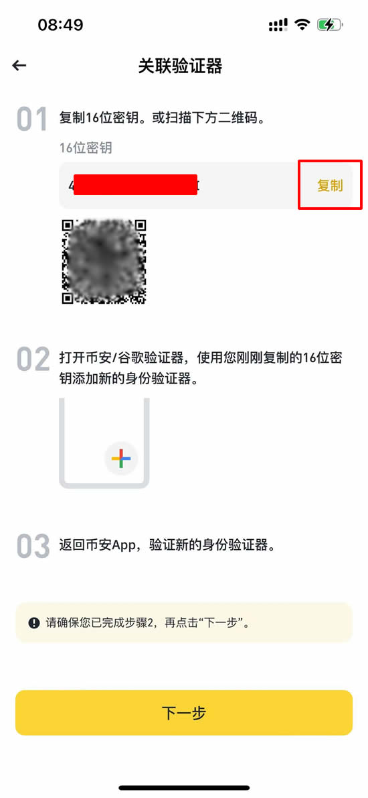

7. 粘贴​​ 16 位密钥或手动输入，您可以在 [服务] 下为您的帐户创建自定义名称，这在将多个帐户添加到 Binance Authenticator 时非常有用。点击【继续】。

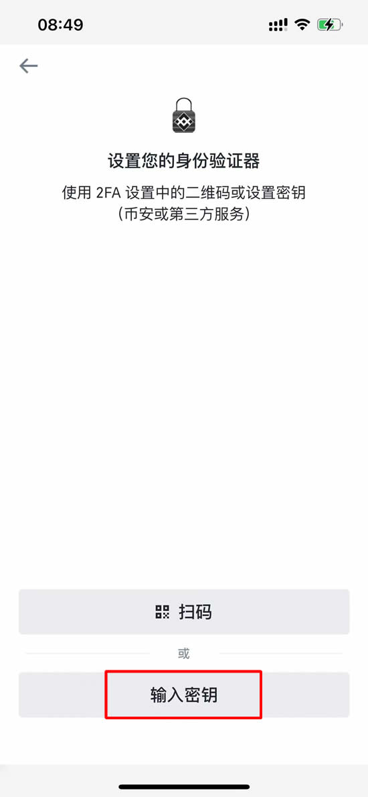
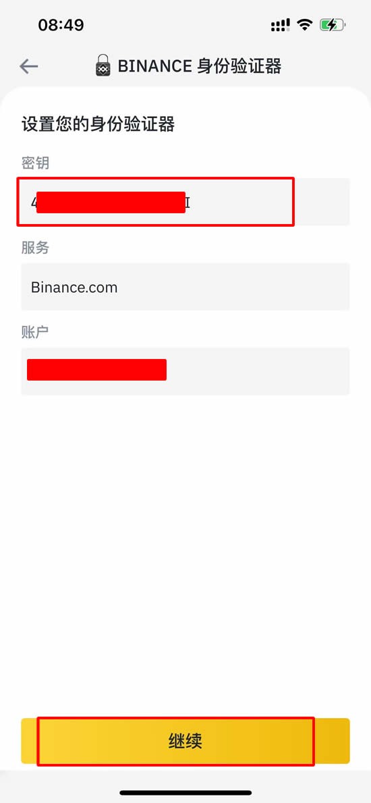

8. 然后会看到一个 6 位代码。

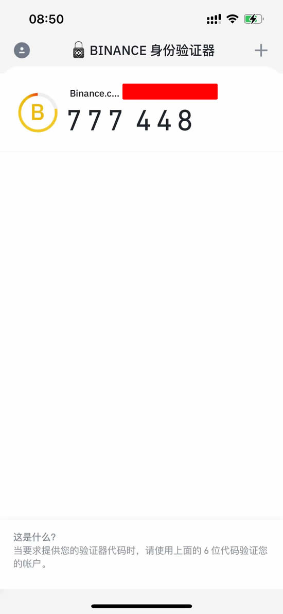

9. 返回币安APP，使用新启用的币安身份验证器验证您的设置请求。点击 [下一步]，输入币安身份验证器中的 6 位数代码，然后点击 [提交]。

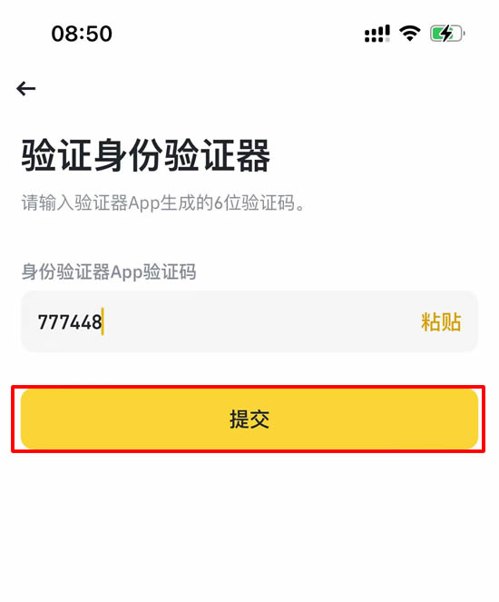

10. 启用Binance Authenticator后，您在登录账户、提取资金等时都需要输入验证码。

# 五、常见问题与解决方法

| 问题 | 解决方法 |
| :--- | :--- |
| **收不到验证码** | 1. 检查垃圾邮件 / 拦截短信文件夹 2. 确认手机号 / 邮箱输入正确无误 3. 等待 60 秒后点击重新发送 4. 切换全局网络代理（或关闭代理）后重试 |
| **实名认证 (KYC) 失败** | 1. 检查证件照片是否反光、模糊或边缘被裁剪 2. 确认填写的个人信息与证件完全一致 3. 人脸识别时摘下眼镜/帽子，确保光线充足 4. 务必使用原相机，避免使用任何美颜滤镜 |
| **无法下载 APP** | 1. **安卓用户**：直接通过官网提供的链接下载 APK 安装包 或者 通过谷歌应用商店 2. **iOS 用户**：必须使用海外（如美区、台区）Apple ID 登录 App Store 下载 3. 遇到页面卡顿可尝试清除浏览器缓存后重试 |
| **账户被限制** | 1. 检查是否已按平台要求完成对应等级的实名认证 2. 回忆近期是否有频繁异地登录等触发风控的异常操作 3. 直接在官网或 APP 右下角联系币安官方在线客服协助解封 |

# 六、重要提醒
合规风险：中国大陆居民参与境外数字货币交易存在政策风险，请谨慎考虑

信息安全：切勿向他人泄露账户密码、验证码、谷歌验证器密钥等信息

资金安全：建议只在官方渠道操作，避免使用第三方平台或代充服务

风险提示：数字货币交易存在高风险，投资需谨慎，量力而行

以上就是币安 (Binance) 2026年最新注册与实名认证操作步骤教程的详细内容

