import BinanceCard from '@/components/BinanceCard.astro';

    

        文章详细介绍了如何通过币安的 <strong>C2C 功能</strong>使用中国身份证购买加密货币，包括<strong>筛选商家、支付与放币</strong>等核心步骤，并提供了一些实用的<strong>安全技巧</strong>和优惠信息。
    

# 打破谣言与核心逻辑——什么是 C2C？
拿着中国身份证到底还能不能购买加密货币？别被网上的谣言吓退了，答案是肯定的：可以。

但首先你需要搞懂一个核心逻辑：由于监管原因，我们不能直接使用银行卡向交易所充值。我们需要通过币安（Binance）的 C2C（个人对个人） 功能来完成交易。

这其实和淘宝购物的原理非常相似：你把钱转给商家，商家收到款后，将平台上的 USDT 放行给你。资金流转是在个人之间进行的，而平台作为担保方保障交易安全。

如果你还没有注册币安交易所，可以通过下文的注册链接，自行注册。

<BinanceCard />

# 本文章的配套教程：
1. ### 币安开户教程：
   - #### 图文教程：[币安 (Binance) 2026年最新注册与实名认证操作步骤教程](/posts/binance-register-tutorial-2026-02-27/)
   - #### 视频教程：[这里写视频标题](视频链接)

2. ### 币安c2c买卖usdt：
   - #### 视频教程：[这里写视频标题](视频链接)

3. ### 币安现货与合约交易
   - #### 图文教程：[如何在币安交易所进行现货（币币）| 合约交易？2026最新教学](/posts/binance-spot-and-futures-trading-tutorial-2026/)
   - #### 视频教程： [这里写视频标题](视频链接)

# C2C 买币实操——筛选靠谱商家
身份认证通过后，我们正式开始买币。

1、在 币安App(官方下载 官方注册) 首页点击“添加资金”，选择“C2C交易”。

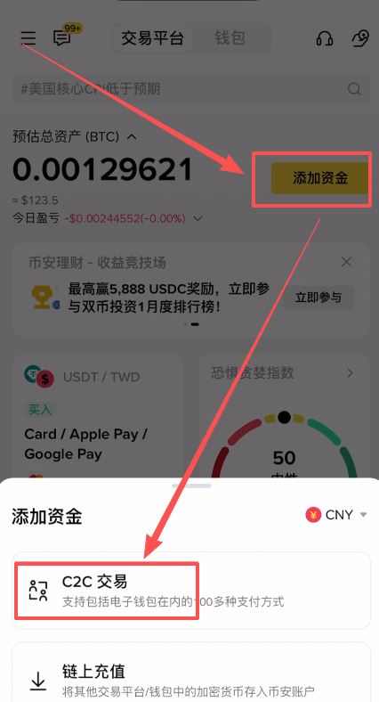

2、进入“自选区”的“买入”页面。

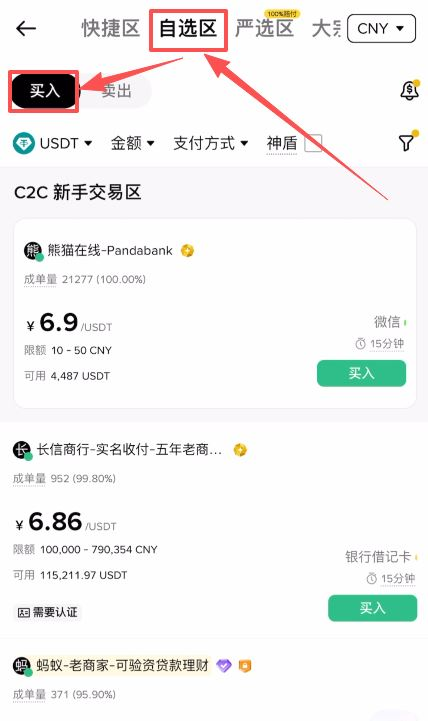

3、筛选条件： 输入你想购买的金额（例如 1000 元），并在支付方式中勾选微信或支付宝。

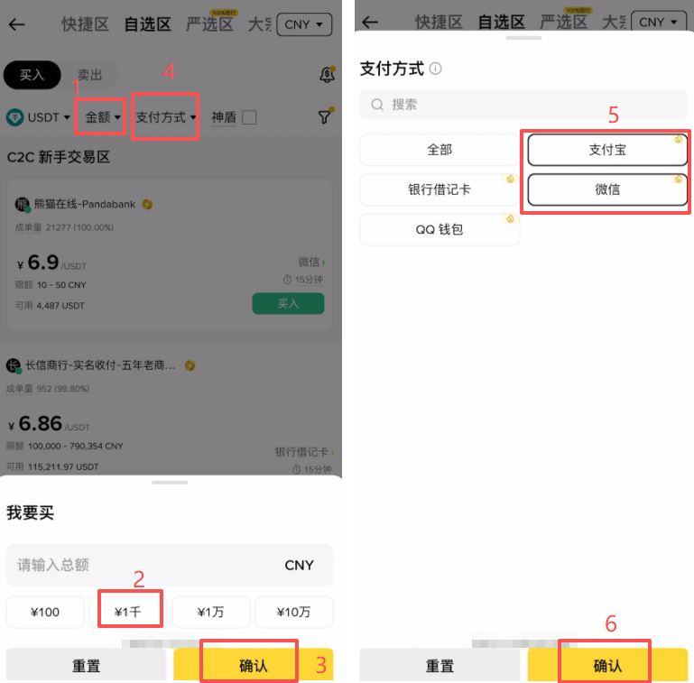

#### 安全技巧： 建议勾选**“神盾”选项。神盾商家是指在平台缴纳了大量保证金的优质商家。如果交易过程中出现问题，平台会使用保证金对用户进行赔付。 在筛选出的列表中，优先选择成单量大、成交率高**的神盾商家进行交易。

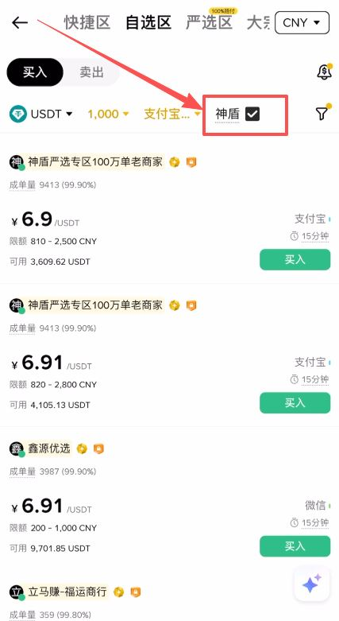

## 支付与放币——完成交易闭环
选定商家后，点击“买入”并确认下单。 订单生成后，你会看到商家的收款二维码或微信号。如果未显示，可以在聊天窗口中向商家索取。

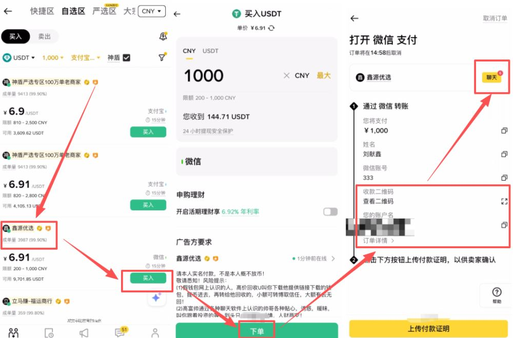

### 操作流程：

1. 离开币安 App，打开微信/支付宝添加商家好友或直接扫码。

2. 完成转账（注意：转账时不要备注任何与加密货币相关的敏感词）。

3. 保留凭证： 转账成功后，务必截图保存。

4. 回到币安 App，点击**“上传付款证明”**，上传刚才的截图，并勾选“已完成转账”。

5. 最后点击*“我已完成付款，通知卖家”。

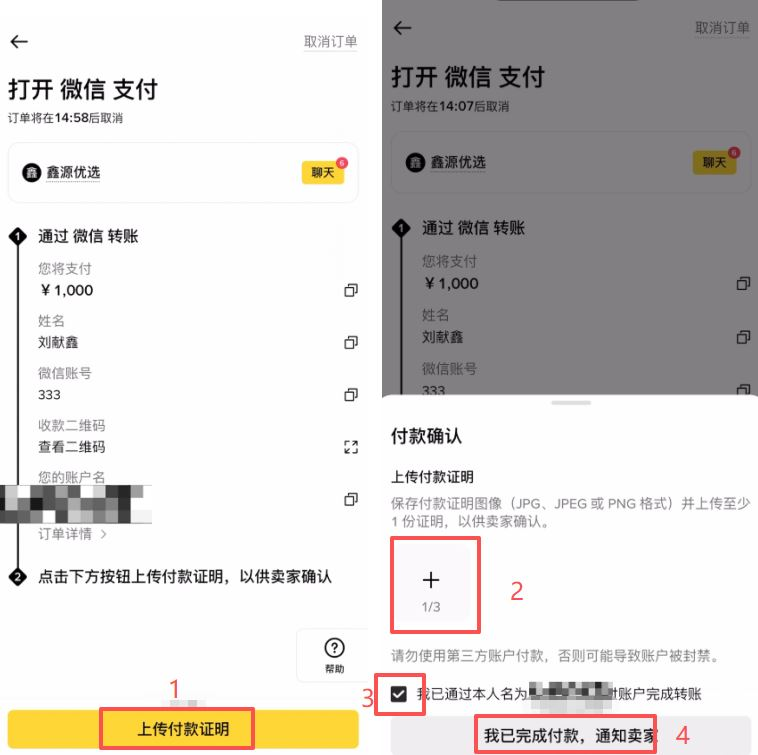

卖家收到款项核实无误后，就会将 USDT 放行到你的资金账户中。至此，你就成功使用人民币购买到了加密资产。一般几分钟内就可以完成放币的操作

# c2c卖币-提现到支付宝

在币安交易所APP的首页，我们可以点击【添加资金】，选择【C2C交易】。

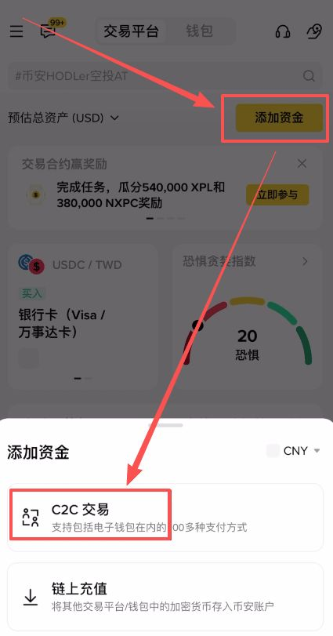

进来之后可以看到它分为快捷区、自选区、严选区以及大宗区。

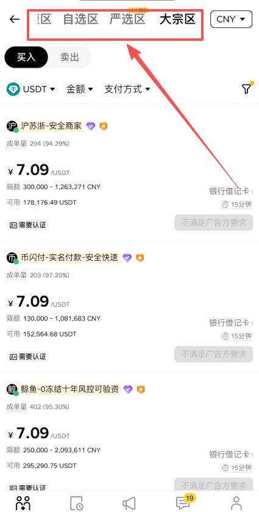

“严选区”是币安交易所新推出的一个区域，可以看到它这里明确标识了交易出现问题是100%赔付的，所以在严选区进行出金和入金，安全性是最高的。接下来我们就使用 严选区来进行提现的操作。

首先选择【卖出】，金额这里我们可以筛选我们想要出售的金额，比如说我想卖出1000人民币的USDT。然后支付方式这里，也就是我们的收款方式，就可以选择“支付宝”，点击【确认】。

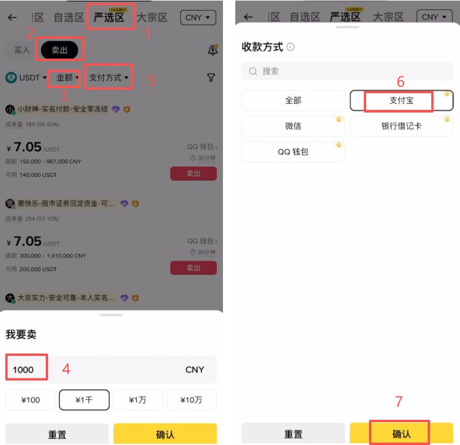

这样下面就出现了符合我们条件的商家，首先我们可以看到报价最高的是6.94，其次是6.93，我们就忽略这些6.94的商家，从报价次之的6.93的这些商家里面去选择，因为高价收U是有一定的风险的。

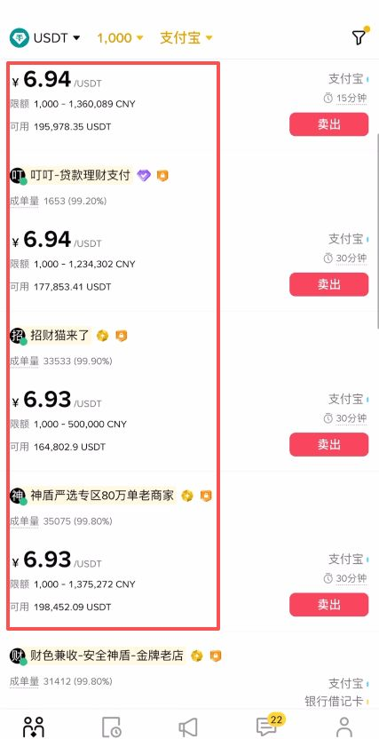

接下来就需要我们自行去筛选一个靠谱的商家去跟他交易。首先我们来看他的成单量以及成交率，要选择越高越好的。然后点开他的主页，查看一下他的账户已创建时间和首次交易至今时间，一定要越久越好，至少也要是1年以上的。因为他的账户存货的时间越久，就证明他的资产越安全，交易了这么长时间以来，没有出现过什么问题。确认跟他交易之后，我们就可以点击右边这里的【卖出】。

在这里输入我们想要提现的金额或者是数量，然后点击“选择支付方式”。这里就可以添加上我们的收款方式，点击这里的+号。

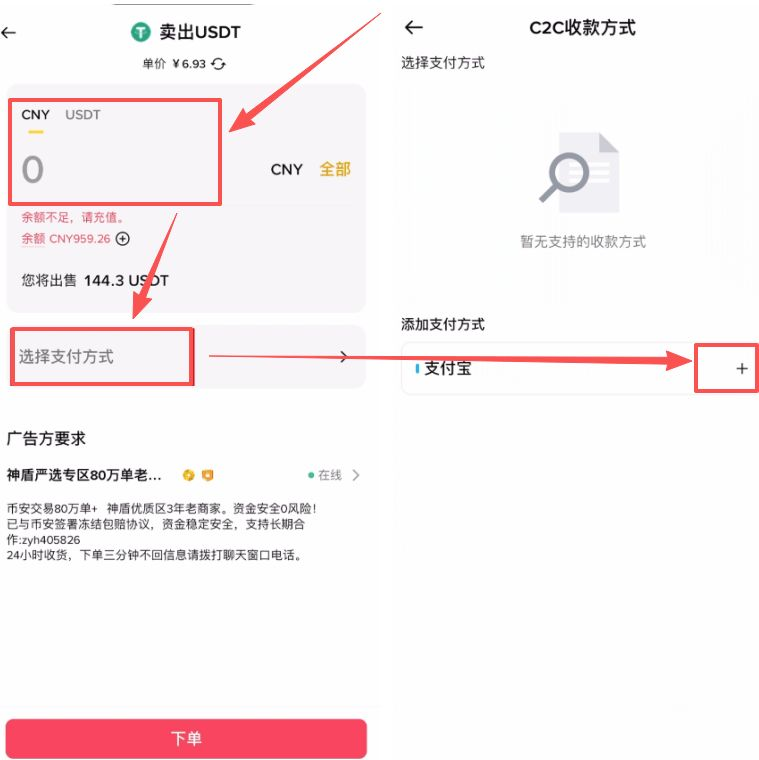

支付方式我们就选择“支付宝”，下方的姓名是自动实名的。接下来就需要我们输入我们的支付宝账号以及我们的收款二维码，点击确认后，把它添加上。

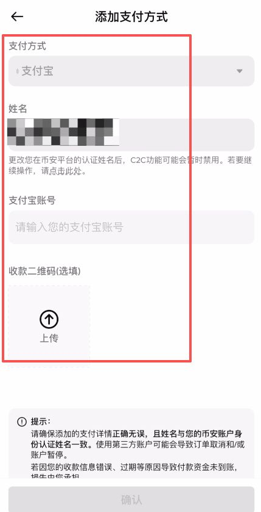

添加好收款方式之后，我们再点击这里的【下单】，这样商家那边就会给我们的账户打钱了。注意一定要确认我们收到钱了之后，再回到平台把币放给商家。要以我们账户里面实际的资产变动为准，这样我们就完成了一个，从币安交易所提现到支付宝的操作。

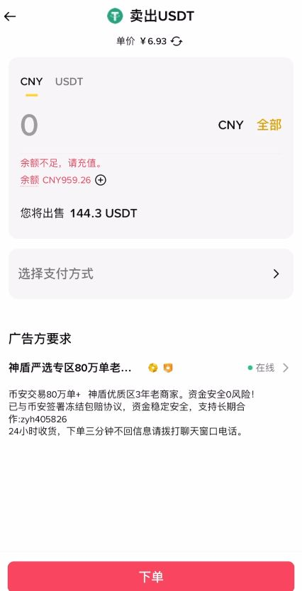

### 通过币安严选区进行 C2C 提现，可以在保障资金安全的同时完成法币出金操作。只要选择成交率高、交易历史久的商家，设置好收款方式，并坚持“先到账再放币”的原则，就能有效降低风险。整体流程清晰简单，适合新手用户按步骤操作，实现安全、稳定地将加密资产兑换成人民币。 

