import BinanceCard from '@/components/BinanceCard.astro';

    

        本文详细介绍了如何在交易所进行<strong>现货（币币）交易</strong>与<strong>合约交易</strong>，帮助新手快速掌握这两种核心交易方式：
    

    <ul class="list-disc list-inside text-gray-700 dark:text-gray-300 space-y-2 ml-2 m-0">
        <li><strong>现货交易（币币）：</strong>通过稳定币实际买卖比特币等加密货币，买入后真实持有该资产，等待上涨获利。</li>
        <li><strong>合约交易（保证金）：</strong>无需实际持有该币种。通过“保证金”模式，投资者既可以<strong>做多（看涨）</strong>也可以<strong>做空（看跌）</strong>，在市场的双向波动中皆可寻找获利机会。</li>
    </ul>

# 准备工作
首先你需要有一个币安的账户以及已经完成了入金的操作，如果你还没有，可以参考下方的教程完成开户以及入金操作
1. ### 币安开户教程：
   - #### 图文教程：[Binance币安2026注册及KYC实名认证教程](/posts/binance-register-tutorial-2026-02-27/)
   - #### 视频教程：[这里写视频标题](视频链接)

2. ### 币安c2c买卖usdt：
   -  #### 图文教程：[2026年如何安全购买加密货币？币安交易所C2C买币的全面指南](/posts/binance-c2c-buy-crypto-guide-2026/)
   - #### 视频教程：[这里写视频标题](视频链接)

3. ### 币安现货与合约交易
   - #### 视频教程： [这里写视频标题](视频链接)

<BinanceCard />

# 一、现货交易
#### 如何在币安交易所进行现货（币币）交易？现货交易就是在交易所使用稳定币买卖 比特币等加密货币，也叫币币交易

## 现货交易的含义
通过稳定币（与美元挂钩，价值恒定）购买包括比特币在内的其他加密货币或者出售加密货币为稳定币被称为币币交易，通常又把币币交易叫做现货交易。

## 现货交易流程
下面会以币安交易所购买BTC所为例展示现货交易的流程（其他交易所大同小异，就不专门写一篇教程了）。

1. #### 首先需要拥有稳定币，可以通过C2C的方式购买USDT，参考《如何在交易所通过C2C交易购买或出售加密货币？》。

#### 注：稳定币是加密货币的其中一种类型，价值与美元挂钩，最常用并且使用最多的稳定币是USDT。1稳定币的价格恒定为1美元的加密货币被称为稳定币，目前有USDT、BUSD、USDC、TUSD等数种不同的稳定币。

2. #### 接着把资金（USDT）划转到对应交易的（现货）账户，不同交易所的（现货）名称可能有差异，但是都很容易理解。

3. #### 然后点击币安App专业版的交易按钮，进入现货交易区，然后选择交易对，见下图。

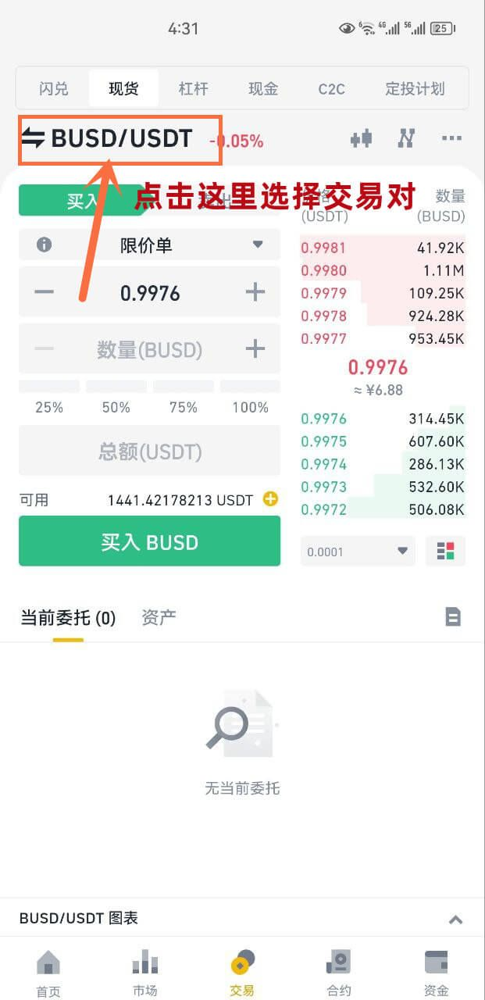

## 什么是交易对？

交易对是交易平台上可以相互交易的资产。每个交易对包含一个基础资产和一个报价资产。

- 基础资产：交易对中的第一个加密货币，即您想要买入或卖出的币种。
- 报价资产：交易对中的第二个加密货币，即用于报价的币种。
  
以 BNB/BTC 交易对为例，BNB 为基础资产，而 BTC 为报价资产。

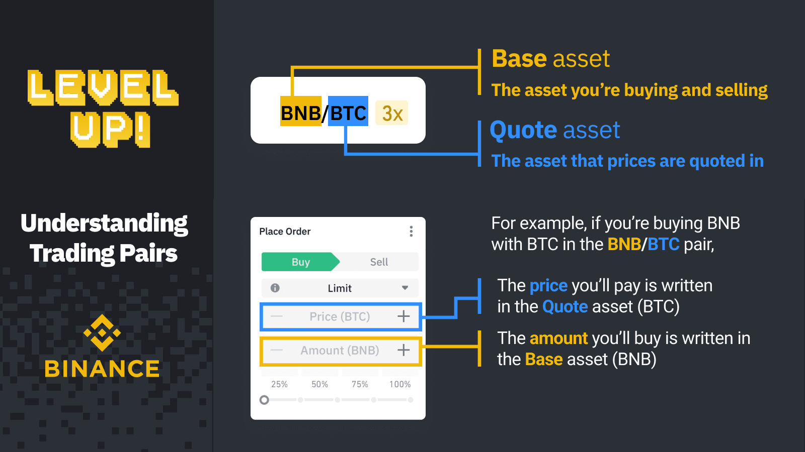

4. #### 输入要购买的加密货币BTC，选择BTC/USDT交易对，第一个就是。

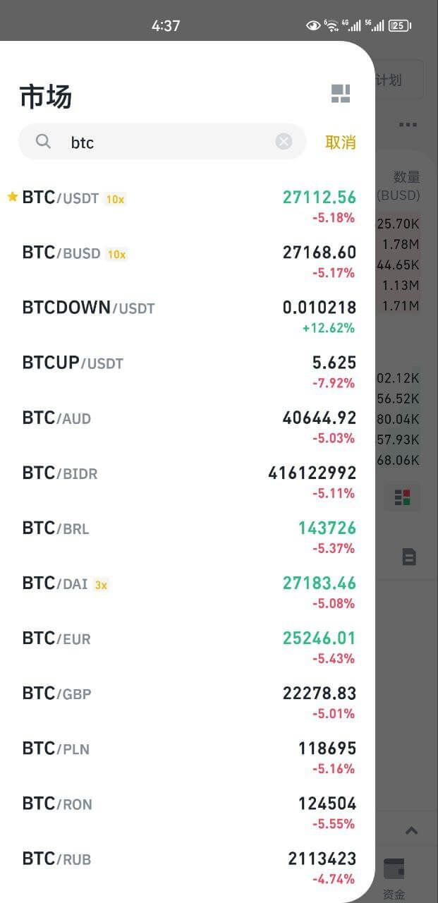

5. #### 输入要购买的比特币数量或者USDT数量，然后点击买入BTC即可。

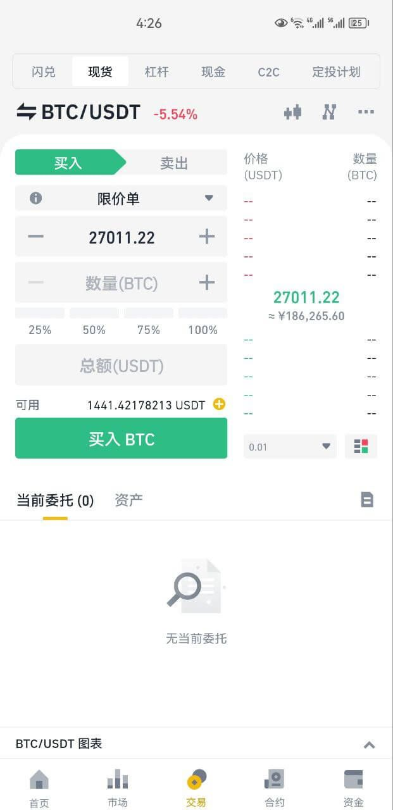

以上是币安现货交易买入的教程，点击现货交易区的卖出即可切换到现货卖出界面。

## 现货交易的下单方式
在现货交易区我们可以看到默认的下单方式是限价单，点击限价单按钮，我们可以看到所有的下单方式。其中最常用的是限价和市价两种下单方式。

- 限价：当价格到指定的价格才成交，比如当前比特币价格是30000USDT，如果想以29000USDT的价格买入，就使用限价单的下单方式，当比特币的价格跌倒29000USDT时之前的订单才能成交，在未成交前可以随时取消交易。
- 市价：按照当前市场最优的价格，立即买入或卖出成交。意思是按照当前价格立即买入或卖出。
- 其他下单方式：主流交易所都支持通过点击下单方式旁边的倒感叹号¡查询详细说明。

# 二、合约交易
币安合约怎么玩？币安作为全球加密货币交易量排名第一的交易所，非常适合刚入圈的新手家人们。很多人在币安注册完现货账户后，想尝试合约交易赚更多收益，但不知道从哪里开始。那么，币安合约怎么下单呢？

下面，手把手教你如何在币安玩合约（U本位永续合约为主，这是新手最常用、最好上手的品种）。有需要的朋友一起看看吧！

## 币安合约交易是什么？
币安合约是一种金融衍伸品交易形式，听起来很复杂，其实可以简单理解为不用真的买币，也能靠预测价格波动获利的交易方式。且在涨跌的过程中，投资者可以利用杠杆放大自己的资金，以获取更大的利润（同时承担更大的风险）。

与现货交易不同的地方，合约交易是采用保证金来进行交易，手上并不能实际持有或出售某种币种。因此投资者不需要像现货交易等待该币种才上涨赚钱，而是利用合约交易做多（看涨）也或者做空（看跌）从市场中获利。

## 币安合约交易介面

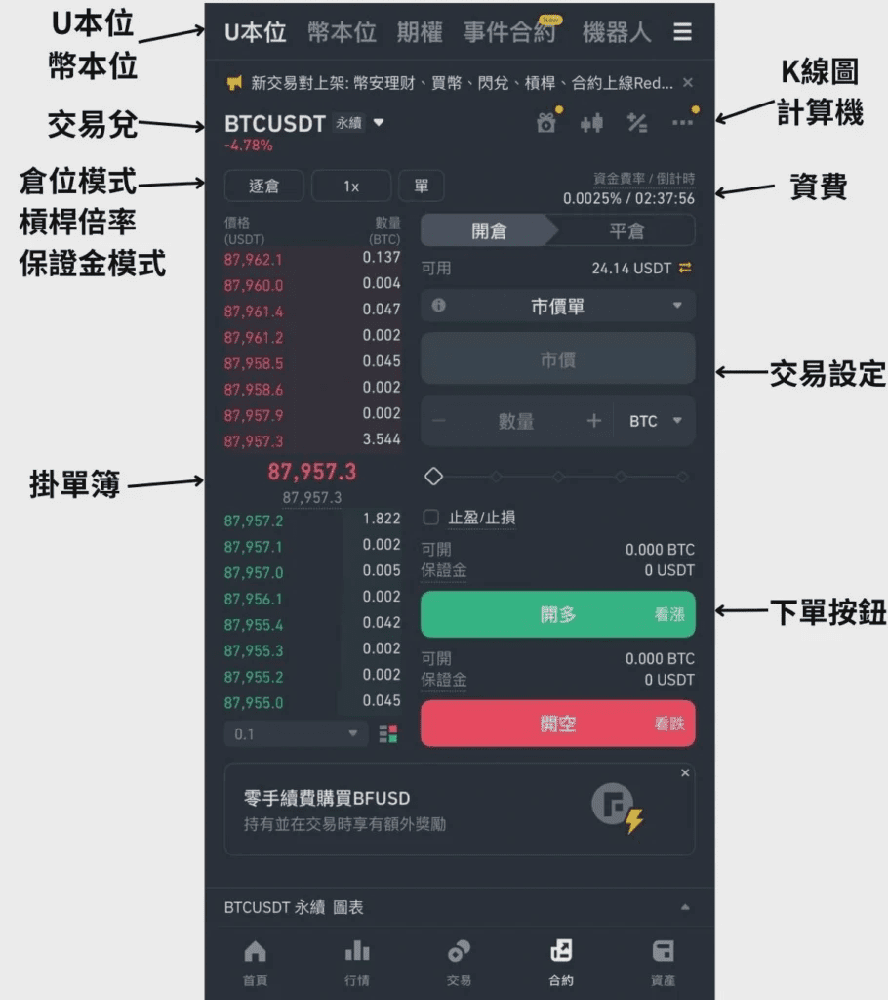

在币安合约交易中，U本位和币本位是两种不同的合约交易机制，主要区别在于使用的保证金种类以及结算方式。

- U本位：在新手这种合约模式中，USDT或USDC作为保证金，并且在结算时使用你开仓时所投入的币种（比如如果你是用USDT开仓，那么盈亏就会以USDT来结算）。这意味着你只需要关注USDT的价值，计算相对简单，适合使用。
- 币位：在币位模式下，保证金以加密货币（如BTC、ETH）作为抵押，并且盈亏也根据你开仓时投入的加密货币来结算。这种模式需要你承担所选币种的价格波动风险，因此计算上会有些复杂。

如果您是新手，建议先选择 U本位模式进行合约交易，这样计算方式比较洞察，并且风险也相对较低。

## 了解合约交易介面
资金转进合约帐户后，即可打开交易介面。

以下以U本位永续合约为例，针对常见功能介绍：

1.  #### 以BTCUSDT为例，显示-3.05% 就是跟24小时之前比，跌了-3.05%。资金费率是确保期货与现货价格接近的价格平衡机制：
   
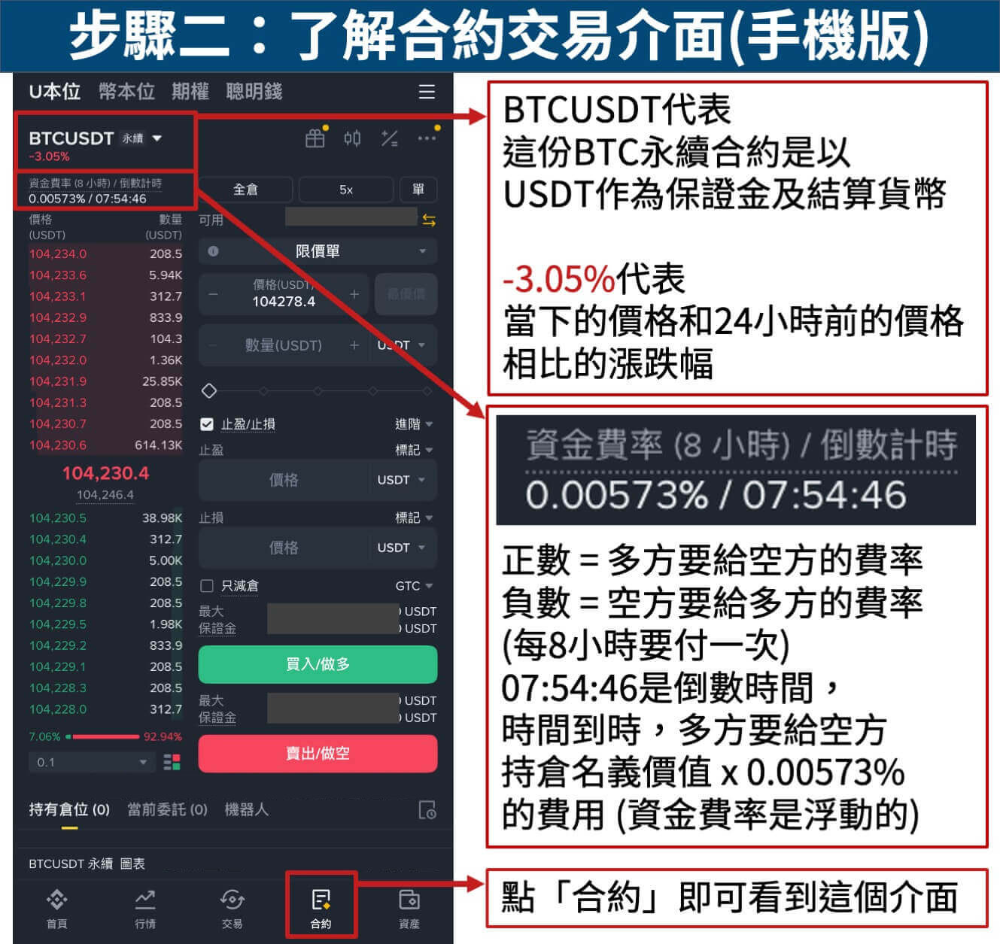

2. #### 委托订单处，会看到不断变动的绿色、红色数字…又称为挂单簿：

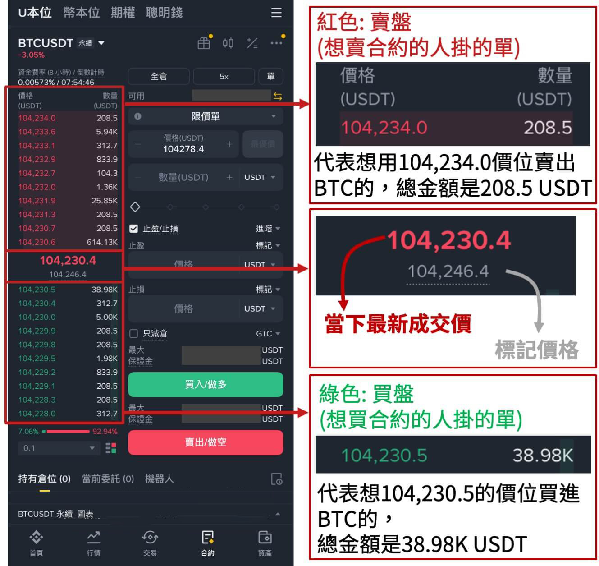

    <table class="w-full text-left border-collapse rounded-lg overflow-hidden shadow-sm">
        <thead>
            <tr class="bg-gray-100 dark:bg-gray-800 text-gray-800 dark:text-gray-200 text-sm uppercase tracking-wider">
                <th class="p-4 font-semibold border-b border-gray-200 dark:border-gray-700 w-1/4">区域 / 指标</th>
                <th class="p-4 font-semibold border-b border-gray-200 dark:border-gray-700">详细说明与市场含义</th>
            </tr>
        </thead>
        <tbody class="bg-white dark:bg-gray-900 text-gray-700 dark:text-gray-300 text-sm">
            <tr class="hover:bg-gray-50 dark:hover:bg-gray-800/50 transition-colors border-b border-gray-100 dark:border-gray-800">
                <td class="p-4 align-top font-medium text-red-600 dark:text-red-400">
                    🔴 红色 (卖盘)
                </td>
                <td class="p-4 align-top leading-relaxed">
                    <ul class="list-disc list-outside ml-4 space-y-1">
                        <li><strong>举例：</strong>价格 104,234.0 对应的数量是 208.5，代表有人想用此价位卖出 BTC，总金额为 208.5 USDT。</li>
                        <li><strong>趋势：</strong>如果卖压强（一堆人排队想卖），价格就会一直往下掉。</li>
                    </ul>
                </td>
            </tr>
            <tr class="hover:bg-gray-50 dark:hover:bg-gray-800/50 transition-colors border-b border-gray-100 dark:border-gray-800">
                <td class="p-4 align-top font-medium text-green-600 dark:text-green-400">
                    🟢 绿色 (买盘)
                </td>
                <td class="p-4 align-top leading-relaxed">
                    <ul class="list-disc list-outside ml-4 space-y-1">
                        <li><strong>举例：</strong>价格 104,230.5 对应的数量是 38.98K，代表有人想用此价位买进 BTC，总金额为 38,980 USDT。</li>
                        <li><strong>趋势：</strong>如果买压强（一堆人排队想买），价格就会一直往上涨。</li>
                    </ul>
                </td>
            </tr>
            <tr class="hover:bg-gray-50 dark:hover:bg-gray-800/50 transition-colors border-b border-gray-100 dark:border-gray-800">
                <td class="p-4 align-top font-medium">
                    ⚡ 当下最新成交价
                </td>
                <td class="p-4 align-top leading-relaxed">
                    <ul class="list-disc list-outside ml-4 space-y-1">
                        <li><strong>显示为红色：</strong>代表卖的人很急，愿意接受较低的价格去主动“吃掉”买单。如果持续爆红，代表市场急于抛售，价格看跌。</li>
                        <li><strong>显示为绿色：</strong>代表买的人很急，愿意付更高的价格去主动“吃掉”卖单。如果持续爆绿，代表市场急于买入，价格看涨。</li>
                    </ul>
                </td>
            </tr>
            <tr class="hover:bg-gray-50 dark:hover:bg-gray-800/50 transition-colors">
                <td class="p-4 align-top font-medium">
                    🎯 标记价格
                </td>
                <td class="p-4 align-top leading-relaxed">
                    是你交易合约时，计算<strong>损益</strong>和<strong>保证金</strong>的基准价（也就是系统用来判断你目前是赚是赔、以及是否需要补充保证金/面临爆仓的标准）。
                </td>
            </tr>
        </tbody>
    </table>

    

        <strong>💡 补充说明 (红绿颜色更改)：</strong> 
        默认设定通常是“绿涨红跌”。如果你看不习惯（比如习惯了国内A股的“红涨绿跌”），可以在币安 APP 首页点击 <strong>左上角菜单 ➔ 右上角设置符号 (齿轮) ➔ 颜色配置</strong> 进行更改。
    

3. #### 准备下单处，可看到全仓/逐仓、杠杆倍数、单/联设定：

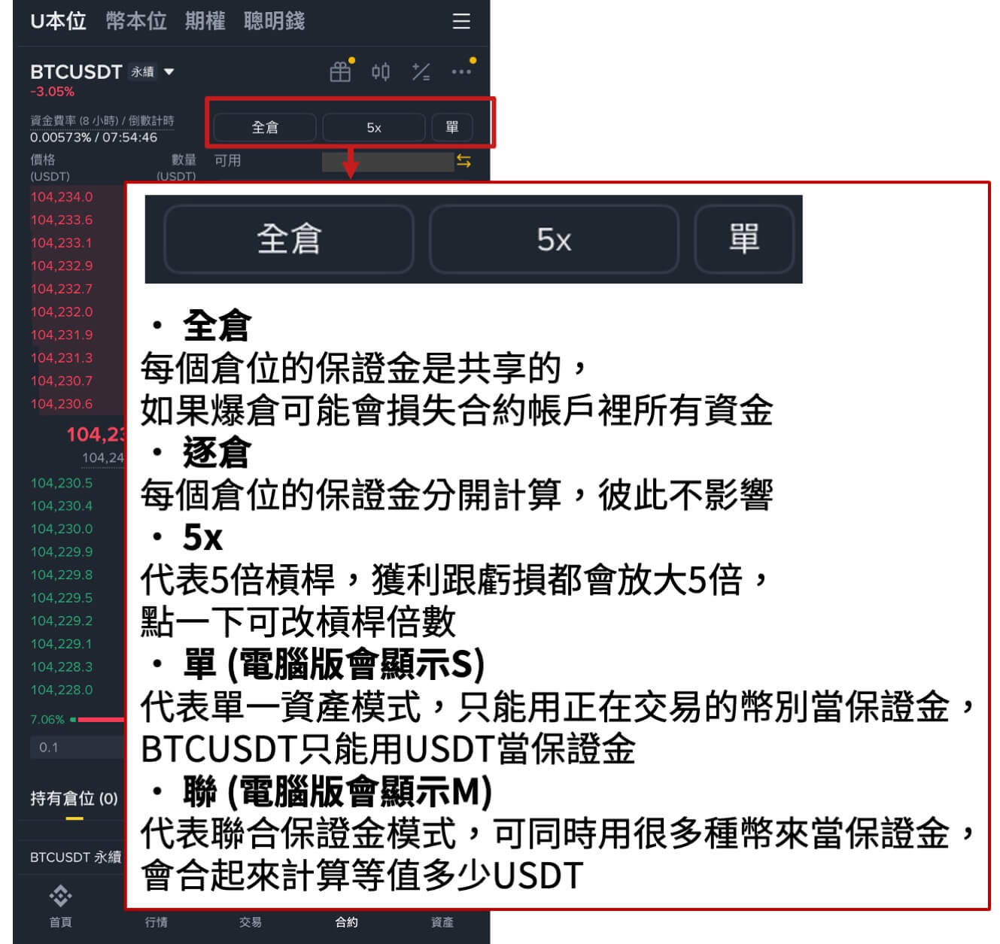

新手切记不要开太大的杠杆，不然很容易爆仓(你放在合约帐户里的保证金被亏光，系统帮你自动结束交易的意思)，

S/M一般会维持S，这是比较进阶的功能，有兴趣可自行研究。

这部分比较重要的是全仓跟逐仓的观念：

    <table class="w-full text-left border-collapse rounded-lg overflow-hidden shadow-sm">
        <thead>
            <tr class="bg-gray-100 dark:bg-gray-800 text-gray-800 dark:text-gray-200 text-sm uppercase tracking-wider">
                <th class="p-4 font-semibold border-b border-gray-200 dark:border-gray-700 w-1/4 whitespace-nowrap">保证金模式</th>
                <th class="p-4 font-semibold border-b border-gray-200 dark:border-gray-700">详细说明与风险提示</th>
            </tr>
        </thead>
        <tbody class="bg-white dark:bg-gray-900 text-gray-700 dark:text-gray-300 text-sm">
            <tr class="hover:bg-gray-50 dark:hover:bg-gray-800/50 transition-colors border-b border-gray-100 dark:border-gray-800">
                <td class="p-4 align-top font-medium text-purple-600 dark:text-purple-400">
                    🌐 全仓 
                    Cross Margin
                </td>
                <td class="p-4 align-top leading-relaxed">
                    <ul class="list-disc list-outside ml-4 space-y-1 m-0">
                        <li><strong>原理：</strong>以合约帐户里<strong>所有资金</strong>作为联合担保。</li>
                        <li><strong>优点：</strong>只要帐户总资金充足，能承受的浮亏空间大，<strong>爆仓机率较小</strong>。</li>
                        <li><strong>风险：</strong>一旦触发强制平仓，合约帐户内的<strong>全部资金都会归零</strong>（风险是把本金全部赔光）。</li>
                    </ul>
                </td>
            </tr>
            <tr class="hover:bg-gray-50 dark:hover:bg-gray-800/50 transition-colors">
                <td class="p-4 align-top font-medium text-orange-600 dark:text-orange-400">
                    🔒 逐仓 
                    Isolated Margin
                </td>
                <td class="p-4 align-top leading-relaxed">
                    <ul class="list-disc list-outside ml-4 space-y-1 m-0">
                        <li><strong>原理：</strong>为单一仓位分配<strong>独立、固定金额</strong>的资金作为担保。</li>
                        <li><strong>优点：</strong>能有效隔离风险，<strong>最多只赔掉该仓位设定的资金</strong>，绝不会牵连帐户里的其他余额。</li>
                        <li><strong>风险：</strong>由于单笔担保资金较小，抗回撤能力弱，在剧烈波动时<strong>更容易被“洗出场”</strong>（极易触发单笔单子的强制平仓）。</li>
                    </ul>
                </td>
            </tr>
        </tbody>
    </table>

    

        <strong>⚠️ 新手避坑指南：</strong> 
        强烈建议刚接触合约的新手，无论如何都先使用 <strong>「逐仓」</strong> 模式进行交易，并带好止损。这是保护你本金不被一次性“爆光”的最后一道防线！
    

4. #### 接下来就是下单介面，填想交易的价位、数量后，即可下单：

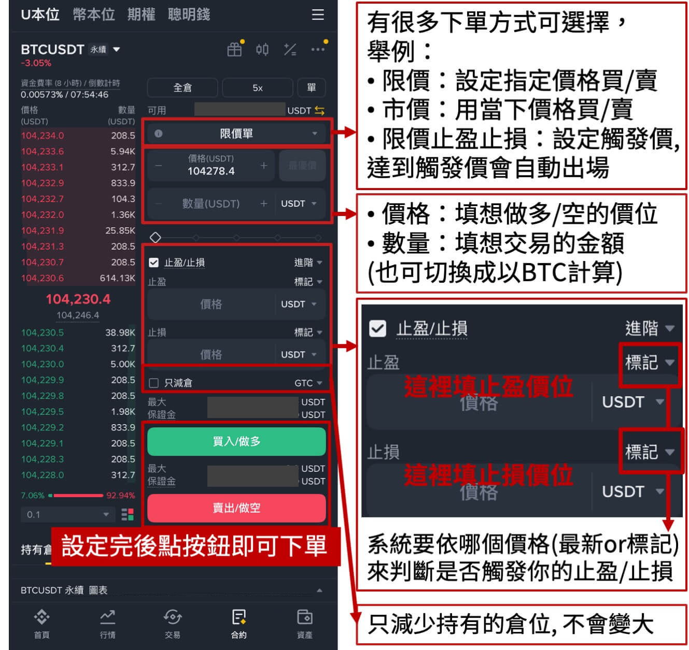

    <table class="w-full text-left border-collapse rounded-lg overflow-hidden shadow-sm">
        <thead>
            <tr class="bg-gray-100 dark:bg-gray-800 text-gray-800 dark:text-gray-200 text-sm uppercase tracking-wider">
                <th class="p-4 font-semibold border-b border-gray-200 dark:border-gray-700 w-1/4 whitespace-nowrap">订单类型</th>
                <th class="p-4 font-semibold border-b border-gray-200 dark:border-gray-700">详细说明与操作建议</th>
            </tr>
        </thead>
        <tbody class="bg-white dark:bg-gray-900 text-gray-700 dark:text-gray-300 text-sm">
            <tr class="hover:bg-gray-50 dark:hover:bg-gray-800/50 transition-colors border-b border-gray-100 dark:border-gray-800">
                <td class="p-4 align-top font-medium text-blue-600 dark:text-blue-400">
                    🎯 限价单 
                    Limit
                </td>
                <td class="p-4 align-top leading-relaxed">
                    <ul class="list-disc list-outside ml-4 space-y-1 m-0">
                        <li><strong>说明：</strong>自己设定一个<strong>期望成交的指定价格</strong>，等待市场达到该价位时成交。</li>
                        <li><strong>建议：</strong><strong>新手强烈建议使用限价单</strong>。作为挂单方 (Maker) 提供流动性，手续费通常比市价单更便宜。</li>
                    </ul>
                </td>
            </tr>
            <tr class="hover:bg-gray-50 dark:hover:bg-gray-800/50 transition-colors border-b border-gray-100 dark:border-gray-800">
                <td class="p-4 align-top font-medium text-orange-600 dark:text-orange-400">
                    ⚡ 市价单 
                    Market
                </td>
                <td class="p-4 align-top leading-relaxed">
                    <ul class="list-disc list-outside ml-4 space-y-1 m-0">
                        <li><strong>说明：</strong>不需要自己定价，无论当下盘口价格是多少，系统会以当前最优价格<strong>立刻强制成交</strong>。</li>
                        <li><strong>注意：</strong>下的单会是吃单方 (Taker)，消耗了市场流动性，<strong>通常手续费较高</strong>，且在行情剧烈波动时容易产生“滑点”。</li>
                    </ul>
                </td>
            </tr>
            <tr class="hover:bg-gray-50 dark:hover:bg-gray-800/50 transition-colors border-b border-gray-100 dark:border-gray-800">
                <td class="p-4 align-top font-medium text-red-600 dark:text-red-400">
                    🛡️ 止盈止损 
                    Stop-Limit
                </td>
                <td class="p-4 align-top leading-relaxed">
                    <ul class="list-disc list-outside ml-4 space-y-1 m-0">
                        <li><strong>说明：</strong>自行设定止盈 (停利) 或止损 (停损) 的<strong>触发价</strong>。当最新成交价达到该触发价时，系统会自动帮你把订单推送到市场上。</li>
                    </ul>
                </td>
            </tr>
            <tr class="hover:bg-gray-50 dark:hover:bg-gray-800/50 transition-colors">
                <td class="p-4 align-top font-medium text-gray-600 dark:text-gray-400">
                    📉 只减仓 
                    Reduce Only
                </td>
                <td class="p-4 align-top leading-relaxed">
                    <ul class="list-disc list-outside ml-4 space-y-1 m-0">
                        <li><strong>说明：</strong>勾选此项后，该笔订单<strong>只会减少你当前的仓位</strong>。这能防止你在平仓时，因为行情反转而意外“反向开仓”增加多余的风险敞口。</li>
                    </ul>
                </td>
            </tr>
        </tbody>
    </table>

    

        <strong>⚠️ 下单细节提醒：</strong> 
        在输入订单数量时，请务必留意右上角 <strong>「单位偏好」</strong> 的设定（例如是按 BTC 的个数计算，还是按 USDT 的总金额计算），以免下错仓位大小，造成不必要的损失。
    

#### 在下单处的USDT箭头按钮，点开会出现单位偏好，会影响下单方式，需特别注意：

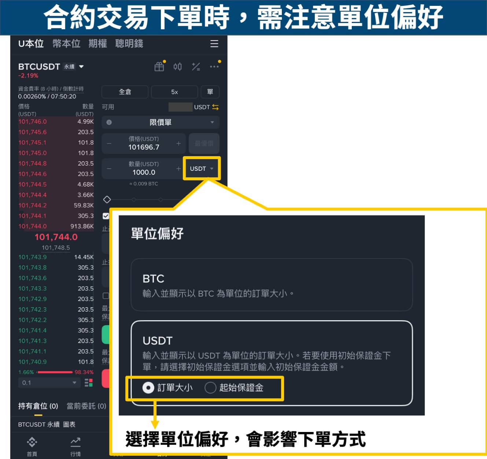

如果选订单大小，下单时要输入的数字是想交易的合约总价值，这里的杠杆倍数影响的你要拿出的保证金。

例如下图我在数量(USDT)填1000 就是合约总价值，如果设定5倍杠杆，那我要拿出的保证金就差不多是这1000经过系统计算出的名义价值÷ 5的金额，约183 USDT：

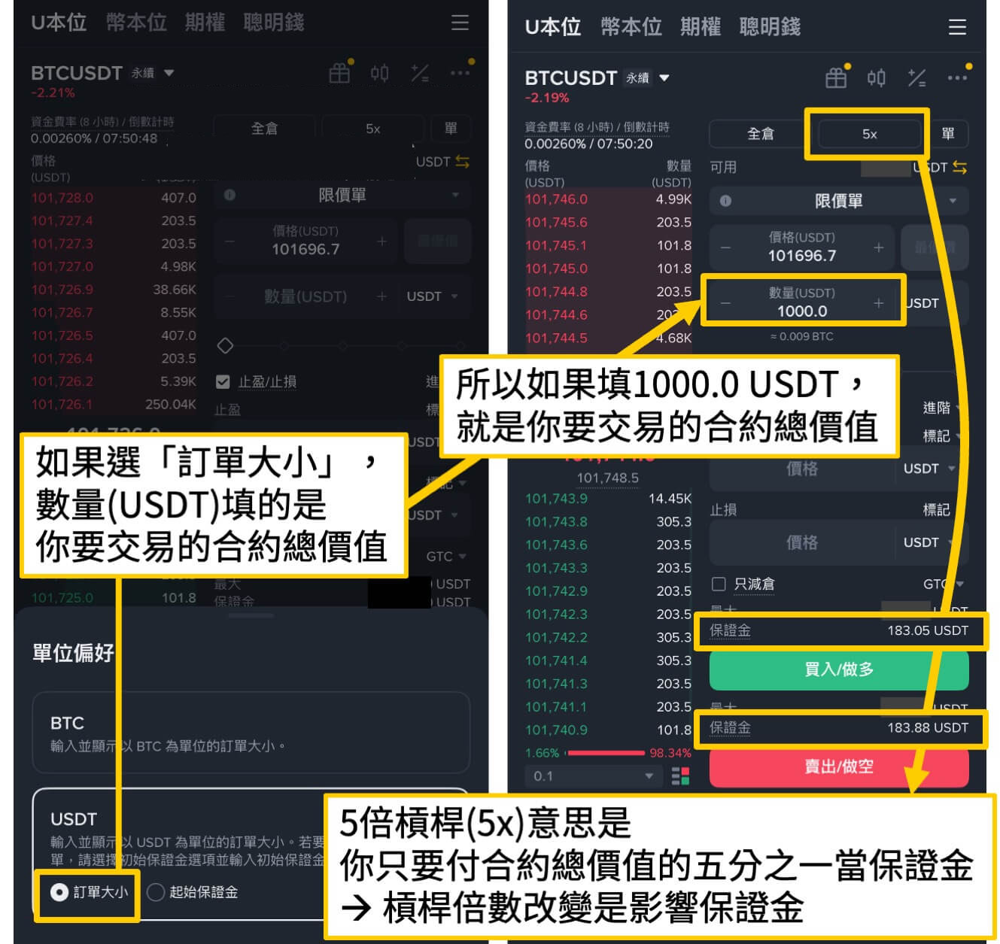

如果选起始保证金，下单时要输入的数字是你要拿出的保证金，这里的杠杆倍数影响的合约总价值。

例如下图我在起始保证金填100 USDT 就是我要拿出的保证金，如果设定5倍杠杆，代表我要交易的是保证金x 5 = 500 USDT的合约：

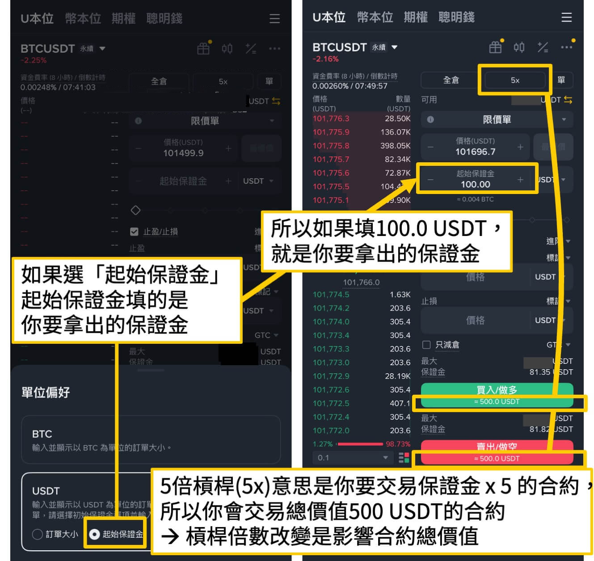

### 注意2：止盈/止损功能，有助于做风险管理
止盈/止损功能，就是自己设停止获利/停止亏损的价位，只要标记价格or最新价格碰到你设的价位，就会出场。

标记价格跟最新价格的差别基本上很小，一般可选标记价格即可。但市场价格激烈动荡时，这两个可能就会差很多，因此下单时要注意最新价格和标记价格之间的差距。

不一定要止盈/止损两个都设定，也可以只设定其中一个，但如果你设的太过偏离当下状况，那就有可能永远不会被触发。

止盈/止损功能的好处：

方便做部位风险管理，减少爆仓可能性
不用随时盯盘
新手可以更加纪律、不会凹单
对投资老手来说，止盈止损是许多交易老手都非常喜欢的功能，不用一直盯盘，也不用担心价格突发意外的走势。

对投资新手来说，了解止盈止损的观念，可以让你对风险控制更了解，交易上也可以更加纪律、不会凹单（凹单就是亏损时不出场、总想等到转亏为盈才出场）。

### 注意3：只减仓功能，可防止额外开仓
只减仓的意思，就是只会减少你现有的仓位，不会增加。

会有只减仓的功能，是因为有时有可能同时下好几张买/卖单，有的甚至是自动下单，有时会在短时间内都成交，造成不是自己预期，但仓位却变大的状况。

例如你持有1 BTC多单，想风险控管所以同时下了止盈跟止损两张单，但市场变动剧烈，可能两种状况会在短时间内发生：

假设系统先触发了止盈价的单→ 这时你的持仓变成0

下一秒又触发了止损价的单→ 这时系统执行这张单，你就变成持有1 BTC的空单(变成开新的仓位)

如果勾只减仓，就不会有开新仓位的状况。

## 币安合约下单教学
假设我看好 BTC 会涨回到 100,000 的话，想要以 10 倍杠杆做多 BTC，那么先选择 BTCUSDT 交易兑并设定逐仓模式，将杠杆设定成 10x 随后以市价下单，接下来在持有仓位中就会看到做多的 BTC。

限价单及市价单的差价如下表：

限价单市价单下单方式设定特定价格，当价格达到时成交立即以当前市场最优价格成交下单优点更优势的成本价、补手续费成交、不怕错过行情下单可能因没吃到单而错过行情流动性不足造成滑点、手续费同时适用情况希望以特定价格买入或卖出的交易者希望立即成交、不想等待的交易者

## 币安合约交易兑
在币安合约交易中，你可以选择不同的交易兑现来进行交易。简单来说，交易兑现决定了你用哪种币种来交易哪种资产。比如，BTCUSDT代表BTC作为标的的合约交易，而保证金及盈亏都是用USDT来结算，ETHUSDT及其他交易兑同理。

更换交易兑现的方式也很简单，投资者可以在合约交易介面点选交易兑现（如下图左侧红框），就可以选择自己偏好的交易兑现进行交易，若该选单内没有您想要投资的标的，在上方搜索栏直接搜索币种即可。

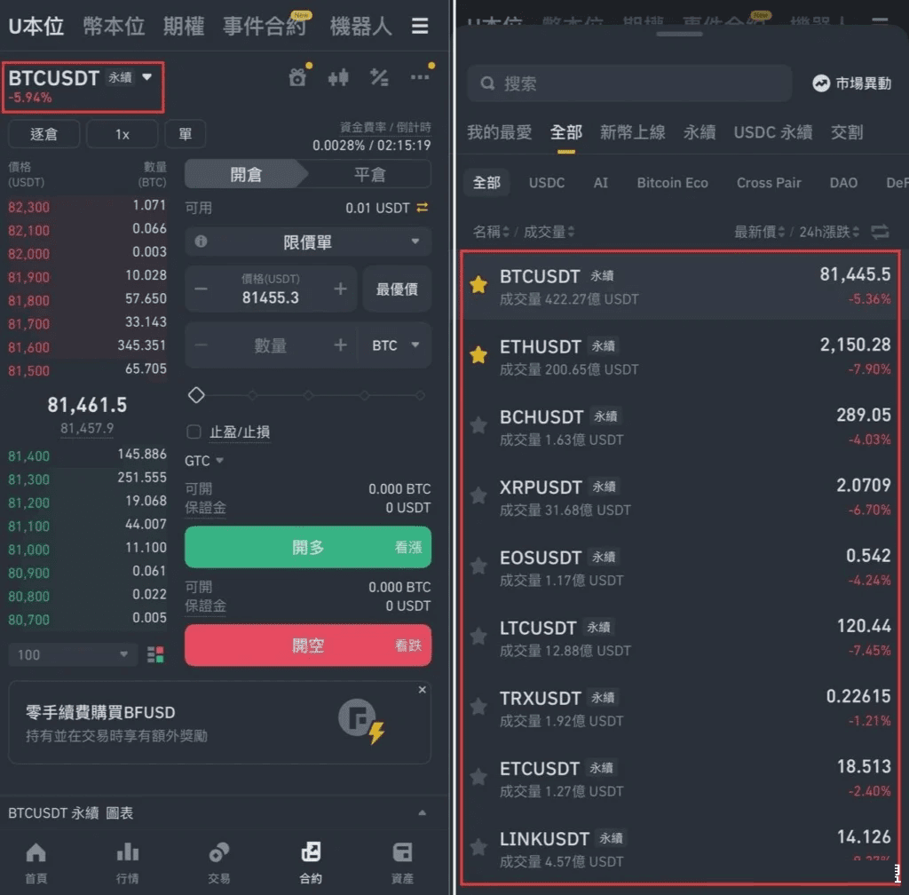

币安还提供了永续合约及交割合约供投资者使用，上的差价如下列表格：

永续合约交割合约逼近日无逼日，可无限期持仓有逼日，投资者需自行注意资金费率有，长期可能造成额外亏损／盈利无资金费率结算方式手动平仓即可，不会因时间强制平仓逼时强制，可手动平仓

若您对于合约并不熟悉，建议以永续合约交易即可，才不会发生针对日自动结算仓位的问题。

## 币安合约全仓逐仓设置
在币安合约交易中，仓位保证金分成全仓及逐仓两种不同的设置。这关系到您账户出现亏损时，系统会如何运作，这将最大程度地影响您亏损的上下限，最坏的情况下，全仓模式可能使您的合约账户归零，逐仓模式则会损失该笔仓位的保证。

### 全仓模式（把钱放在同一个篮子里）

- 共享保证金：全部仓位占用账户内的可用资金作为保证金
- 降低爆仓风险：如果有仓位面临爆仓，系统会自动用你的其他资金补上。
- 可能导致资金全部下跌：如果行情大涨，所有仓位一起爆仓，合约账户可能瞬间归零！
### 逐仓模式（各自独立，风险可控）

- 保证金独立计算：不会因为其中追加交易爆仓而影响其他交易。
- 最大损失有限：最惨也只是亏掉了一笔交易的保证金，不会把合同金额整个赔光。
- 可增加保证金：如果怕爆仓，可以手动增加保证金来撑住仓位。

如果你刚开始接触合约交易建议，不确定怎么管理仓位，先用逐仓模式进行交易，因为它的风险比较容易控制，不会一不小心把整个合约账户光着！

## 币安合约杠杆设定教学
杠杆是合约交易的特色，它让你用小钱玩大额交易，有机会放大利润，但同时风险也变大，所以使用时要特别注意！

如下图所示，投资者可以点击红框处调整杠杆倍率，杠杆通常以x表示，表述的1x即代表一倍杠杆。每间交易所对于各币种杠杆上限皆不同，BTCUSDT合约交易兑支持125倍杠杆供投资者使用。

### 杠杆的优点

- 提高资金效率：用少量本金也能参与大额交易。
- 放大利润：如果方向判断正确，收益会成倍增长。
- 灵活：允许投资者进行多（涨）、空（跌）股票交易，提升盈利机会。
### 杠杆的缺点

- 放大损失：如果方向错了，亏损另外放大。
- 爆仓：当亏损超过您的保证金时，系统会强制平仓（爆仓）并损失所有保证金。
  
建议刚开始接触合约交易的投资者以 1～3倍的杠杆交易，这样即使遇到极限行情也能确保账户减少的损失。

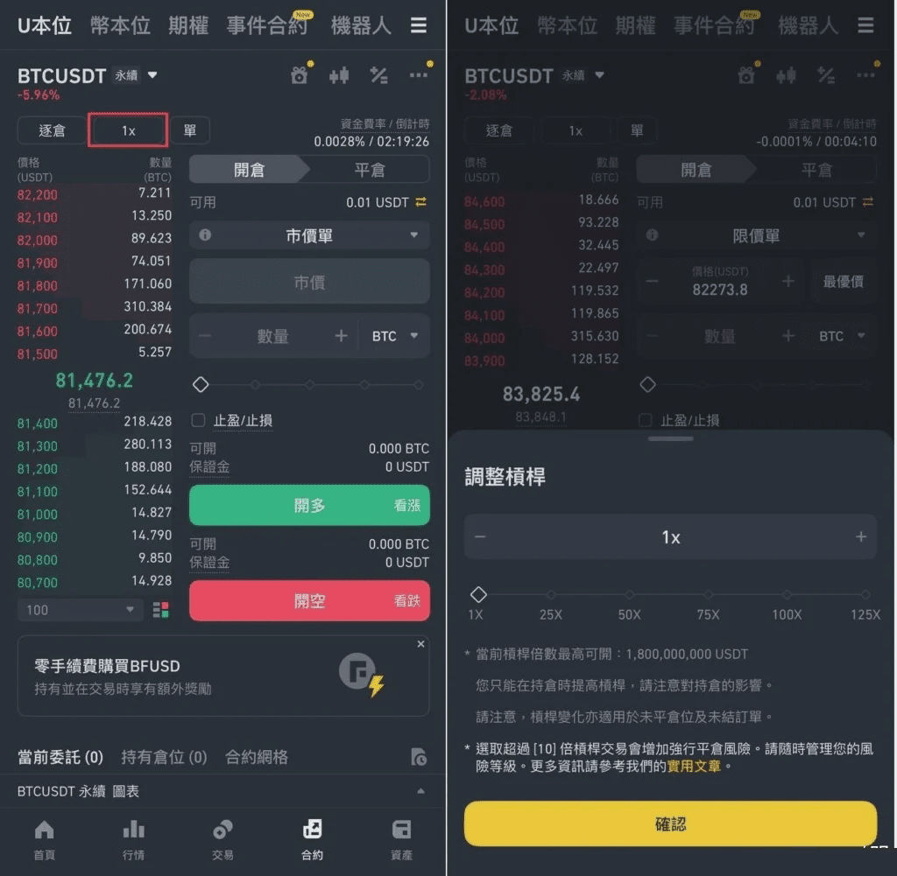

由于再次出现仓位的10倍杠杆称，只要BTC到达79,764（大概下跌10％）左右就会发生爆仓且保证金全数上涨上述，因此价格对于上述的币圈来说相对危险，呼吁刚刚接触的投资者，建议以 1～3倍的杠杆交易。

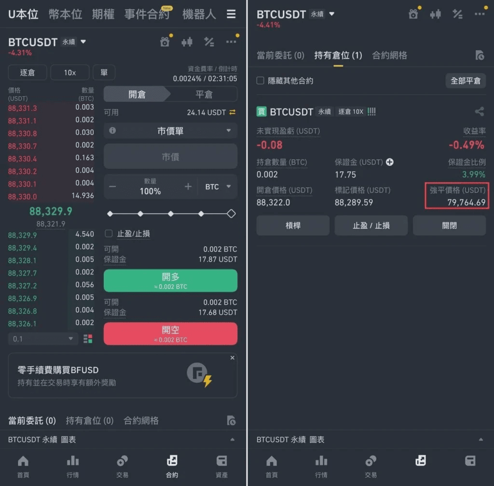

## 币安合约挂单介绍
合约挂单簿是显示当前交易兑买卖订单的位置，可以帮助投资者了解当前市场上的流动性和价格趋势，投资者也可以自行调整订单簿所显示的价格比重。

在币安合约中常见的价格类型包括标记价格及最新价格，这两种价格分别影响着强平价及交易时的共识价格，以下将以表格分析两种价格的差异。

标记价格（标记价格）最新价格（最新价格）定义系统计算所得之合理价格最新成交的价格用途强制平仓依标记价格同步交易（市价、限价）依最新价格统一价格来源现货价格＋资金费率＋价格波动性由挂单簿搓合决定更新频率系统动态调整，避免市场挂单发生改变时即时更新

当我们买入市价的时候，我们需要根据卖方的订单簿上的最新价格进行订单匹配，且市价会有点滑价产生，因此开仓时BTC价格为88,329，但我们的持仓均价却在88,322。

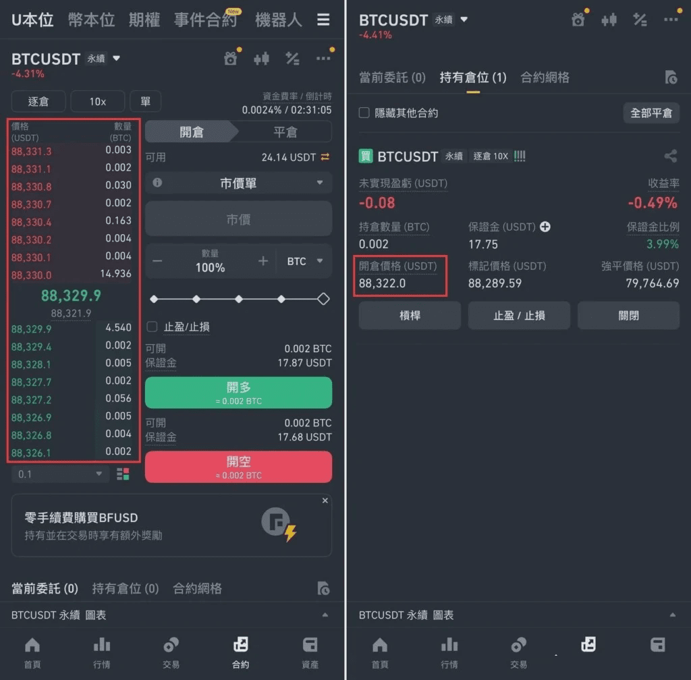

## 币安合约保证金是什么？
保证金相当于投资者的“押金”，它是你用来维持仓位的资金，如前面所说，你不是真正购买比特币，而是用承诺金来进行交易。币安提供多种保证金模式给投资者选择，分别为单保证金模式及联合保证金模式。

- 单币保证金模式：仅认可USDT作为保证金，盈亏仅可在相同资产库存抵销，支持全仓／逐仓两种模式。
- 联合保证金模式：可用USDT＋其他币种作为保证金，盈亏可在不同资产间抵销，仅支持全仓模式。

那我们怎么知道开仓需要多少保证金？

金需求为仓位除以杠杆，以10x做多BTC的仓位来说，我们用10x杠杆开通了0.002颗BTC，当时的BTC价格位约为88,329，将价位乘以颗数0.002约等于176 USDT，不过我们开通10x杠杆，保证金需求因此十分之一，大约17 USDT左右。

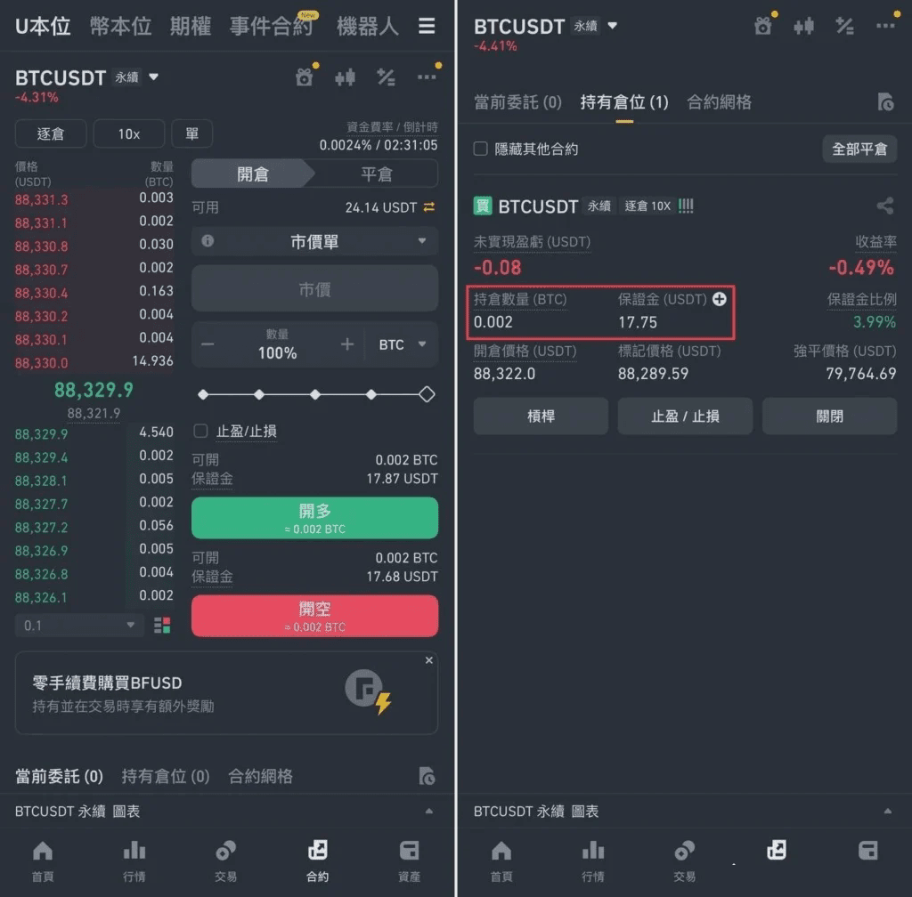

## 币安保证金率怎么计算？
以开我们仓位的BTC 10x多单来说，BTCUSDT在币安公告中的维持保证金为0.4％，则相应仓位的维持保证金比例为88329*0.002（数量）*0.4％＝0.7，再将维持保证金除以仓位保证金可得出保证金比例约为3.98％，与仓位显示的保证金比例相符。

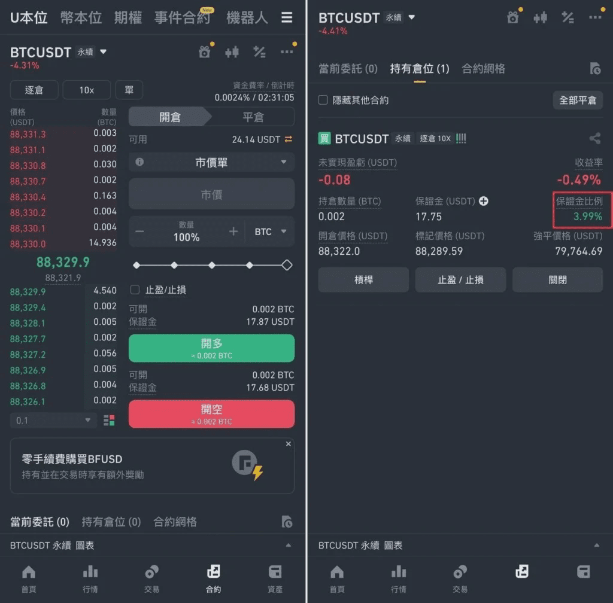

## 币安合约爆仓计算
爆仓（纽约、强平）是指当保证金维持维持仓位时，系统强制将仓位关闭并未收保证金机制的，学习爆仓计算将有助于投资者避免不必要的损失。

爆仓会发生在保证金率大于等于100％时，这部分可用上述保证金公式去计算，若投资者对于计算概念较不熟悉也没关系，币安会在您开启合约交易后将爆仓价格显示在您的仓位中。爆仓时币安会跟交易者收取强平手续费，按强平资产的比例计算：

保证金模式手续费基础全仓杠杆标准模式2％强平资产逐仓杠杆模式2％强平资产全仓专业模式3％强平资产

消费者可以通过以下方法避免爆仓：

- 设定好止损：至少在设定好止损之前的爆仓价位，除被收取附加费外。
- 降低杠杆：降低杠杆将有助于投资者降低爆仓风险。
- 补充保证金：手动补充保证金也有利于消费者规避爆仓风险。

## 币安合约止盈止损设定
在进行币安合约交易时，投资者可以使用止盈（TP，Take Profit）和止损（SL，Stop Loss）来管理风险和盈利。简单来说，止盈是设定一个目标价格，当市场价格达到这个价位时，系统会自动卖出锁定的利润；止损则为了避免亏损扩大，当市场价格跌至设定的止损价时，系统会自动平仓，防止更大的损失。设定顺序如下：

点选止盈／止损功能。

输入止盈、止损价格。

当价格到达设定价位时将自动执行策略并平仓位。
假设今天我想要比特币涨到10万时止损，跌到8万时止损，这样正好可以在强平前止损，那我就照着下图设定

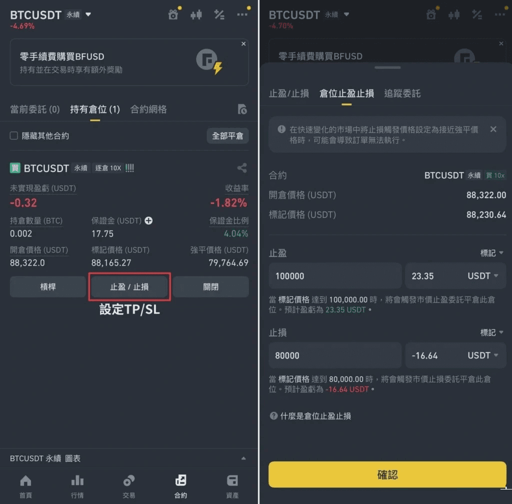

## 币安合约平仓教学
在币安合约交易中，投资者除了可以设定止盈止损外，也可以点击关闭仓位，系统将以市场最优价格进行市价平仓。

平仓后如下图所示，当原有仓位消失时，则代表平仓成功。

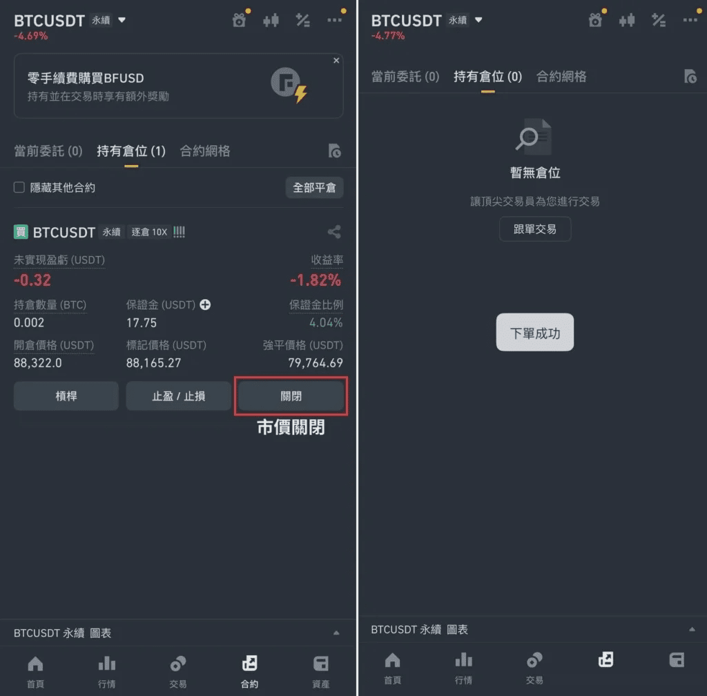

## 币安合约手续费多少？
以一般用户来说，币安合约交易的Maker手续费为万分之二（0.02％），Taker撕万分之五（0.05％）需注意的是开、关仓位各需要支付一次手续费，因此若该笔交易均以Taker进场，整笔订单的手续费可能为千分之一（0.1％）。

Maker是挂单而Taker是吃单，简单来说，当你挂单等待成交，只需订单进入订单簿并等待成交，就会被算作Maker，手续费相对较低。而当你直接用市价单（立即成交）买卖时，那么就属于Taker，手续费会比Maker略高。

有些人以为限价单一定是Maker，但其实如果你的限价单价格贴近市场价格，导致立即成交，那还是会被算作Taker，这一点要特别注意。

### 怎么节省手续费？
- 注册的时候填写邀请码：BN528 交易可以用获取20%手续费返现
- BNB折抵：使用平台币BNB支付手续费可折抵一成手续费（九折）。
- VIP等级：提升币值安VIP等级将有助于降低交易手续费。
各等级VIP手续费可以参考以下这张图：

    <h3 class="text-xl font-bold mb-3 text-gray-900 dark:text-gray-100">
        💰 币安合约手续费标准
    </h3>
    

        币安合约分为 <strong>U 本位合约</strong>（使用 USDT/USDC 结算）和 <strong>币本位合约</strong>（使用币种本身结算）。这两者的基础手续费率是相同的。以下是普通用户至 VIP2 的核心费率表：
    

    <table class="w-full text-left border-collapse rounded-lg overflow-hidden shadow-sm text-sm">
        <thead>
            <tr class="bg-gray-100 dark:bg-gray-800 text-gray-800 dark:text-gray-200 uppercase tracking-wider">
                <th class="p-4 font-semibold border-b border-gray-200 dark:border-gray-700 whitespace-nowrap">用户等级</th>
                <th class="p-4 font-semibold border-b border-gray-200 dark:border-gray-700 min-w-[200px]">条件: 30天交易量 或 BNB持仓</th>
                <th class="p-4 font-semibold border-b border-gray-200 dark:border-gray-700 whitespace-nowrap">标准手续费 (Maker / Taker)</th>
                <th class="p-4 font-semibold border-b border-gray-200 dark:border-gray-700 text-yellow-600 dark:text-yellow-400 whitespace-nowrap">🔥 BNB 抵扣 9折 (Maker / Taker)</th>
            </tr>
        </thead>
        <tbody class="bg-white dark:bg-gray-900 text-gray-700 dark:text-gray-300">
            <tr class="hover:bg-gray-50 dark:hover:bg-gray-800/50 transition-colors border-b border-gray-100 dark:border-gray-800">
                <td class="p-4 font-medium">普通用户</td>
                <td class="p-4">&lt; 15,000,000 USD   或 ≥ 0 BNB</td>
                <td class="p-4 font-mono">0.0200% / 0.0500%</td>
                <td class="p-4 font-mono text-yellow-700 dark:text-yellow-300 bg-yellow-50/50 dark:bg-yellow-900/10">0.0180% / 0.0450%</td>
            </tr>
            <tr class="hover:bg-gray-50 dark:hover:bg-gray-800/50 transition-colors border-b border-gray-100 dark:border-gray-800">
                <td class="p-4 font-medium text-blue-600 dark:text-blue-400">VIP 1</td>
                <td class="p-4">≥ 15,000,000 USD   及 ≥ 25 BNB</td>
                <td class="p-4 font-mono">0.0160% / 0.0400%</td>
                <td class="p-4 font-mono text-yellow-700 dark:text-yellow-300 bg-yellow-50/50 dark:bg-yellow-900/10">0.0144% / 0.0360%</td>
            </tr>
            <tr class="hover:bg-gray-50 dark:hover:bg-gray-800/50 transition-colors">
                <td class="p-4 font-medium text-purple-600 dark:text-purple-400">VIP 2</td>
                <td class="p-4">≥ 50,000,000 USD   及 ≥ 100 BNB</td>
                <td class="p-4 font-mono">0.0140% / 0.0350%</td>
                <td class="p-4 font-mono text-yellow-700 dark:text-yellow-300 bg-yellow-50/50 dark:bg-yellow-900/10">0.0126% / 0.0315%</td>
            </tr>
        </tbody>
    </table>

    

        <strong>💡 省钱必看技巧：</strong> 
        合约交易由于带有杠杆，手续费是按照 <strong>“杠杆放大后的总仓位”</strong> 计算的，长期积少成多非常可观。建议划转少量 <strong>BNB</strong> 到你的“U 本位合约账户”中，系统会自动使用 BNB 抵扣手续费并享受 <strong>10% (9折) 的折扣</strong>！
    

## 币安合约资金费率是多少？
资金费率是币安永续合约中，确保现货价格与合约价格保持逼近的机制，由于永续合约并没有趋于日，若没有资金费率的影响，将有可能使合约与现货存在巨大的价差。资金费率通常每八点合约一次（0、8、16点），但可能会因新币、价差过大等因素调整为四小时甚至两小时间一次。

资金费率不是缴交交易所，而是投资者资金之间互相支付的一种费率。若资费为正值，多单需要支付资金费率给空单，反之亦然。关于资金费率逻辑及套利方法可参考：玩转费率，套利逻辑大解析。

## 币安自动减仓机制说明
自动减仓（Auto-Deleveraging，ADL）是币安为了防止投资者因市场波动而发生超额亏损 机制所设计的一种。当市场出现极限行情，部分仓位的亏损超过保证金，而市场上又没有足够的对手盘来承接这些亏损单时，交易所会启动ADL机制，以确保投资者不会发生超额亏损。

自动减仓的机制不仅限于情景行情，如果该币种缺乏投资者交易导致流动性不足，也可能导致ADL的情况发生。币安会优先针对高杠杆＋未实现收益高的用户进行减仓，如果您的自动减仓灯号即将满格，请务必注意是否会遭遇币安自动减仓。

## ⚠️ 风险提示

加密货币的合约交易属于**高风险、高收益**的投资行为。在使用杠杆时，您的盈利会被放大，但同时**亏损也会被同等倍数放大**。在极端行情下，您可能会面临账户内全部保证金被强制平仓（爆仓）的风险。

* **敬畏市场：** 新手请务必先从现货交易或模拟盘（Testnet）开始，在未完全了解合约机制前，切勿轻易尝试高倍杠杆。
* **资金管理：** 请严格控制仓位，并仅使用您**能够承受全额损失的闲置资金**进行交易，绝对不要借贷炒币。
* **独立判断 (DYOR)：** 本文及本站所有内容仅作为技术教程演示与学习交流使用，**不构成任何形式的投资或财务建议**。请自行评估风险，并对自己的所有交易决策负责。

