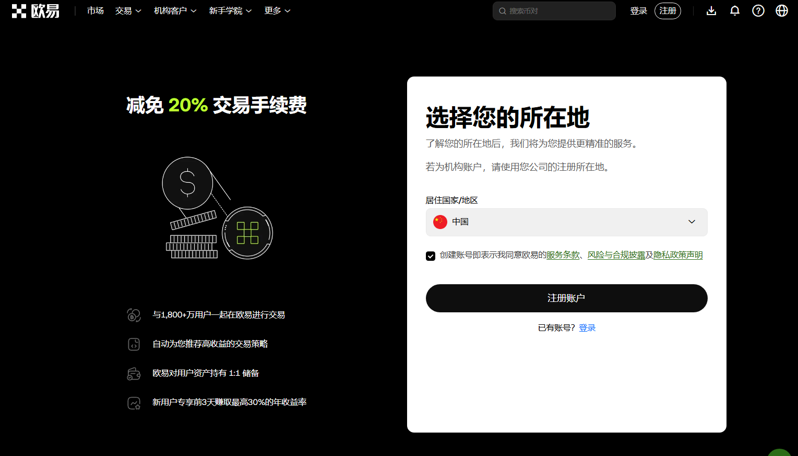
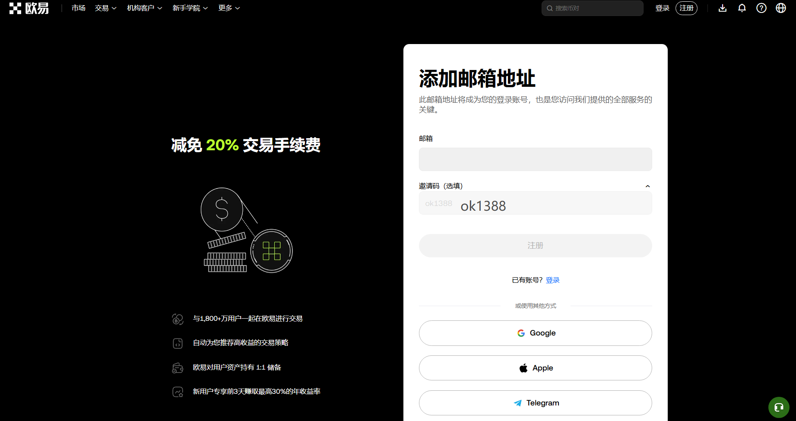
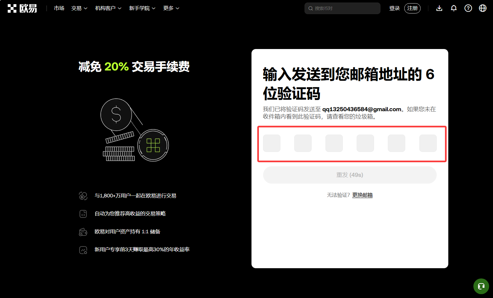
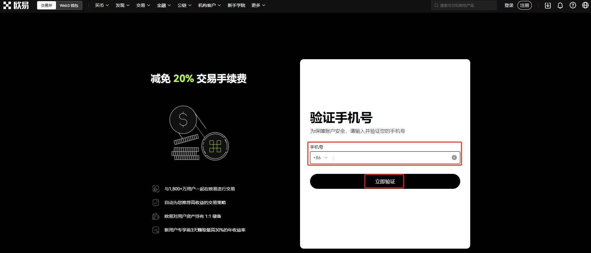
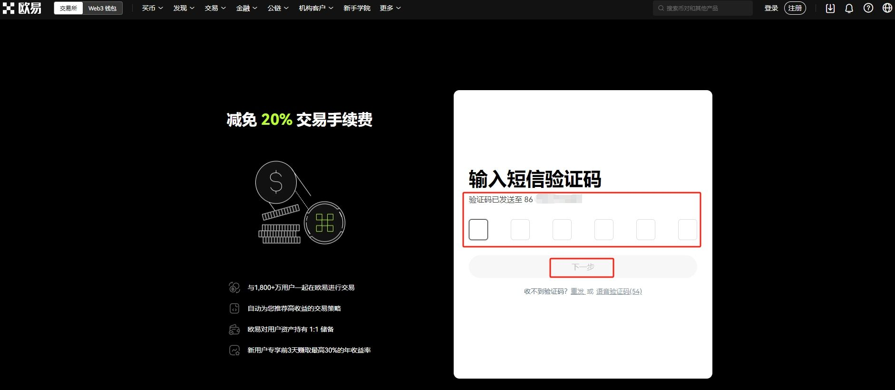
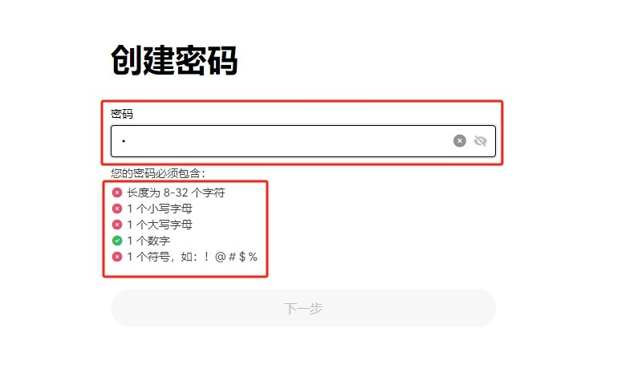
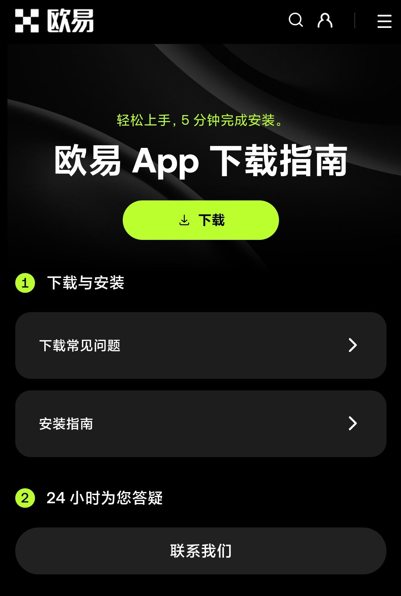
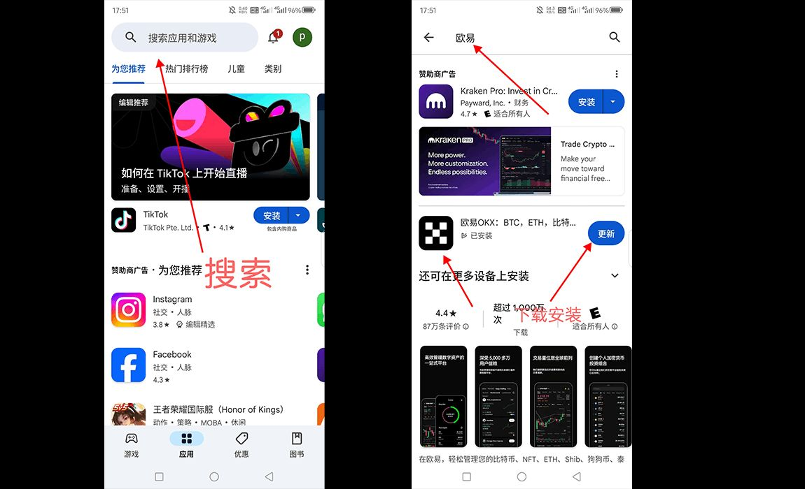

import OKXCard from '@/components/OKXCard.astro';

# 2026欧易开户教程：全程带你完成注册与App下载步骤

欧易怎么开户？无疑是第一个，也是最关键的问题。欧易（OKX）作为全球领先的加密货币交易平台，以其丰富的交易对、强大的功能和较高的安全性，吸引了无数投资者。然而，繁琐的注册流程和安全性考量往往让初学者望而却步。

别担心，这篇“保姆级”终极教程，将手把手、分步骤地带你完成从零到一的整个过程。无论你是完全的小白，还是希望换个平台的老手，这份最新的实战教学都能为你扫清所有障碍。

#### 本文章的配套教程：
1. ### 欧易开户教程：
   - #### 视频教程：[这里写视频标题](视频链接)

2. ### 欧易c2c买卖usdt：
   - #### 图文教程：[新手买USDT全流程教学：欧易OKX C2C安全买币攻略与避坑指南](/posts/okx-register-tutorial-2026.02.25/)
   - #### 视频教程：[这里写视频标题](视频链接)

3. ### 欧易现货与合约交易
   - #### 图文教程：[OKX欧易App现货与合约交易完整操作步骤教程](/posts/okx-xianhuoheyue-2026.02.26/)
   - #### 视频教程： [这里写视频标题](视频链接)

## 超详细开户注册步骤（以网页端注册为例）

欧易[官网注册](https://www.okx.com/zh-hans/join/ok1388)：https://www.okx.com/zh-hans/join/ok1388 (需要翻墙)

欧易[免翻墙](https://bn1688.cc/okx)：https://bn1688.cc/okx

<OKXCard />

居住地/地区选择“中国”，勾选同意服务条款，点击【下一步】。

输入邮箱号（国内可使用163邮箱、QQ邮箱或国外gmail邮箱、outlook邮箱），输入邀请码：ok1388，能够让你在后续的交易中永久享受交易手续费优惠，然后点击【注册】按钮。

输入发送至此邮箱的验证码，点击【下一步】

输入自己的手机号码，点击【立即验证】。

输入手机号验证码，点击【下一步】。

接下来需要设置你的账户登录密码。密码强度要求较高，通常需要包含大写字母、小写字母、数字和特殊符号中的至少三种。设置一个足够复杂且你自己能记住的密码，即可完成注册。

## 欧易交易所官网下载
在你的手机浏览器（Safari、Chrome等）中打开欧易的官方网址（请注意，由于网络访问问题，你可能需要一些辅助手段才能访问）。官方网址通常为 okx（请以官方最新公告为准）。

进入官网登录后，页面通常会自动识别你的设备，并显示下载按钮。点击“下载App”或类似的按钮。

使用手机扫描二维码，浏览器会提示你下载安装包。根据你的手机系统（iOS或Android），完成下载和安装。
注意：苹果系统需要海外的ID才能下载，建议注册一个中国台湾的Apple ID

海外Apple ID注册视频教程：[【2025 美区Apple ID最新注册教程，无需信用卡，大陆手机号、一次成功】](https://www.bilibili.com/video/BV1fzSEBGEen/?share_source=copy_web&vd_source=da8d06430c55e31ec1a52eec07c6fd06)

成品ID购买：[账号星球](https://accboyllafx.acceboy.com)https://accboyllafx.acceboy.com

欧易[官网](https://www.okx.com/zh-hans/join/ok1388)：https://www.okx.com/zh-hans/join/ok1388 (需要翻墙)

欧易[免翻墙](https://bn1688.cc/okx)：https://bn1688.cc/okx

### 应用商店下载
对于海外用户，可以直接在Google Play Store或Apple App Store（使用相应地区的账户）搜索“OKX”进行下载。

### 注册时收不到短信验证码怎么办？
首先检查手机号码是否正确，手机信号是否良好，是否开启了短信拦截功能。可以尝试60秒后重新获取。如果多次尝试仍失败，可以切换至邮箱注册方式。

### 实名认证失败是什么原因？
最常见的原因是：① 身份证照片模糊、有反光、缺角；② 身份证已过期；③ 人脸识别时环境过暗或面部有遮挡；④ 填写的个人信息与身份证信息不一致。请根据提示重新操作。

### 欧易平台合法安全吗？
欧易是全球顶级的交易平台之一，在技术安全和合规方面投入巨大。但需要明确的是，在任何平台存放资产都存在风险（如技术风险、政策风险等）。因此，除了依靠平台的安全措施，用户自身的安全意识（如不泄露密码、启用二次验证、不点击不明链接）更为重要。对于大额资产，建议使用自有钱包（如硬件钱包）进行存储。

### 开户后如何入金开始交易？
完成认证后，点击底部的【资产】 按钮，选择【充值】，选择你想要充值的加密货币（如USDT），复制你的充值地址或扫描二维码，从其他钱包或平台将资产转入该地址即可。如果是新手可直接在首页使用C2C入金。

视频教程：
1. okx欧易C2C交易视频教程：[USDT如何购买？欧易Okx买卖usdt教程。微信、银行卡、支付宝](https://www.youtube.com/shorts/csKq4OqEmNw)  

### 总结
跟着这篇保姆级教程一步步操作，你已经成功知道了“欧易怎么开户？”这个问题，并拥有了一个功能齐全、安全系数较高的欧易账户。从下载App、注册、到完成实名认证和安全设置，整个过程看似复杂，但一旦走通，就会发现其实非常顺畅。

