import OKXCard from '@/components/OKXCard.astro';

    

        欧易（OKX）是一个全球知名的数字资产交易平台，它提供加密货币的币币交易、衍生品交易以及 Web3 生态服务，并以其丰富的交易品种和全球用户基础而著称。那么，新手怎么买 USDT？下文将为大家详解欧易 OKX 新手买 USDT 全流程教学。
    

新手怎么买USDT？零基础USDT购买指南！详细讲解OKX C2C买币全流程，帮你避开新手买币6大陷阱，掌握安全交易技巧。支持支付宝、微信、银行卡，5分钟即可完成第一笔USDT入金。

想当初我第一次买U的时候，对着付款页面紧张了半天，反复确认了三遍地址，生怕钱转错了。

当看到USDT到账的那一刻，感觉新世界的大门打开了。为了让大家少走弯路，我把最简单安全的USDT教程总结了出来。

#### 本文章的配套教程：
1. ### 欧易开户教程：
   - #### 图文教程：[欧易开户教程：全程带你完成注册与App下载步骤](/posts/okx-register-tutorial-2026.02.25/)
   - #### 视频教程：[这里写视频标题](视频链接)

2. ### 欧易c2c买卖usdt：
   - #### 视频教程：[这里写视频标题](视频链接)

3. ### 欧易现货与合约交易
   - #### 图文教程：[OKX欧易App现货与合约交易完整操作步骤教程](/posts/okx-xianhuoheyue-2026.02.26/)
   - #### 视频教程： [这里写视频标题](视频链接)

# 一、新手买USDT，最怕的6个坑
## 1.1 USDT到底是个啥？
USDT是什么？它是一种稳定币，和美元是1:1挂钩的，1USDT价值一直约等于1USD。

所以可以理解为，除了USDT这样的稳定币之外，其他的非稳定币都是属于波动较大的资产。

你可以理解为你买了一样东西，这样东西因为种种原因，价格一直在波动，只有你手里的钱是实打实短时间内不会波动太大的。

简单来说：USDT是你手里的钱，BTC/ETH就是黄金，黄金价格一直在波动。

## 1.2 安全吗？钱会不会被骗？
一般而言，如果是使用的平台C2C功能，一般都是有平台在后面托管资金，这个形式很像淘宝店，但又有些不一样。

你下单后，你买的USDT就像被放进了一个透明的保险箱，平台帮你管着。

你这边付款给商家，商家确认后，平台‘咔’一声打开保险箱，把USDT直接给你。整个过程你的币都是安全的。

所以中间要是出现交易纠纷，平台是可以管控整笔交易的。

## 1.3 为何买了币不能马上提走？
这一块主要是防止小白被骗，因为整个加密货币交易，包括转账等功能，和传统的银行转帐有很大区别，且涉及到各种地址。

想象一下，你好不容易买好了币，结果被‘热心人’一步步指导，最后眼睁睁看着币转到了骗子的地址，那种感觉有多绝望？

为了防止这种悲剧，平台设置了T+1限制，就像给你的资产加了一道‘冷静期’保险，虽然麻烦一点，但关键时刻能救你的本金！

所以平台一般对于大额交易，都会有一些提币限制，就是防止小白被骗。这一部分被限制提币的资金，依然可以用于交易，例如在平台内交易BTC或者以太坊等。

## 1.4 会收到来路不明的“黑钱”吗？
买币一般不会收到黑钱，因为此时的钱是你自己的。

你将钱打到平台，平台会对收到的币进行安全检查，确保不是来路不明的‘黑钱’，你可以放心。

## 1.5 为何商家要求“沉淀资金”？
这几年你是不是也遇到过？刚把钱从工资卡转到生活卡，想立刻用，结果发现账户被限额几百块！连我们自己转账都这样，商家就更怕收到这种‘快进快出’的钱导致账户被风控了。

所以，他们才希望你的付款资金在卡里‘待了一会儿’，这就是所谓的‘沉淀资金’。

## 1.6 支付宝/微信会被风控吗？
支付宝和微信的大数据风控是非常严格的，而且这两个平台一般也都进行小额交易，大额的一般都是走的银行卡。

所以为了防止我们自己的常用的支付宝或微信，受到影响，建议使用支付宝或微信小号，大额则直接用银行卡稳一点。

# 二、欧易OKX C2C买币流程
这里小编就以OKX为例，演示一下如何使用C2C功能买币。

如果你当前还没有欧易(OKX)，可以直接在这个官网注册一下；十分钟就可以搞定。

<OKXCard />

## 1、选择交易商家
打开欧易交易所APP，点击【C2C买币】。
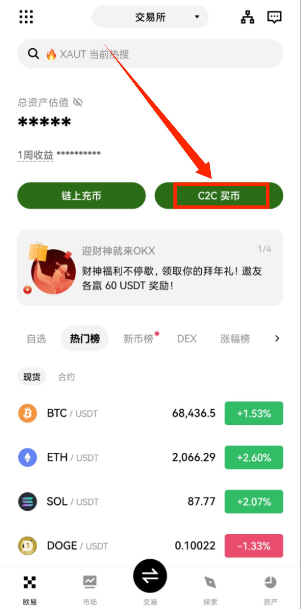

上方选择“C2C”交易，因为C2C交易就是个人对个人交易。选择【购买】，要购买的币种是USD，USDT就是泰达币，它跟美元是1:1挂钩的，你可以理解为USDT就是数字货币里面的美元，购买其他的数字货币要通过USDT。

我们输入一下要购买的金额，比如说500人民币，点击【确认】。后边可以选择一下支付方式，有银行卡、支付宝还有微信支付，你习惯使用哪种方式支付就使用哪种方式支付。比如说我勾选“支付宝”，点击【确认】。

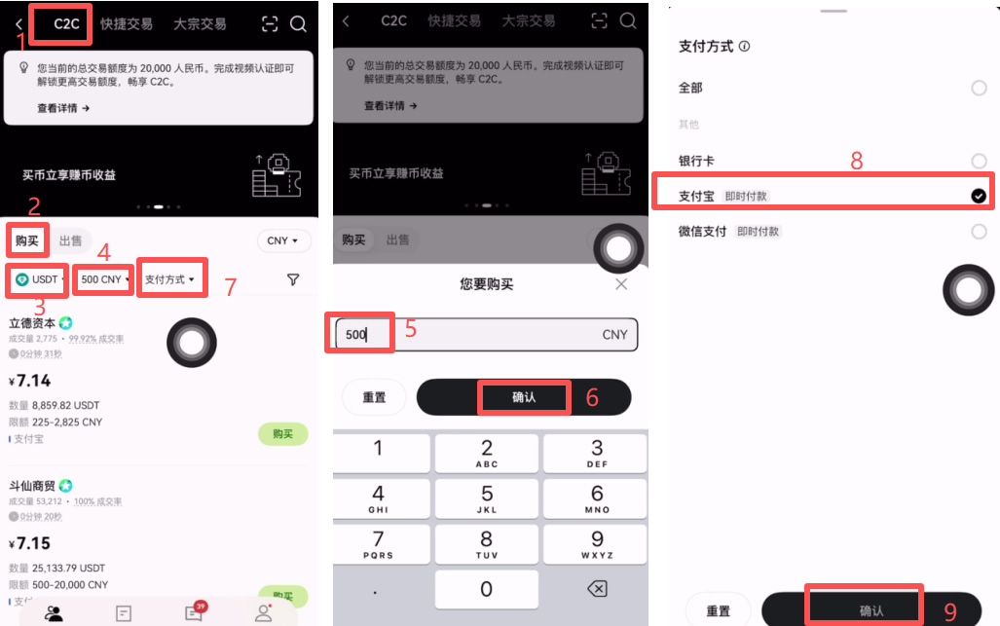

接下来欧易平台就会为我们筛选出符合要求的商家了，我们不仅要找成交量和成交率高的商家，还要找注册时间比较久的商家来进行购买。我们来看一下第一家，他的成交量挺高的，成交率是100%，我们再来看一下他的注册时间，这一家是在24年12月注册的，注册时间还没有一年。我们再看一下下一家，我们最好要找注册时间超过一年的商家。

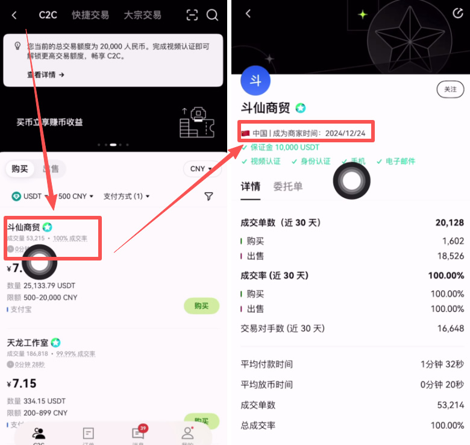

“天龙工作室”这一家，在23年4月30号就已经注册了，已经注册有两年了。他近30天的成交率是100%，成交单数也还不错，我们就可以跟这家来进行购买。点击旁边的“委托单”。

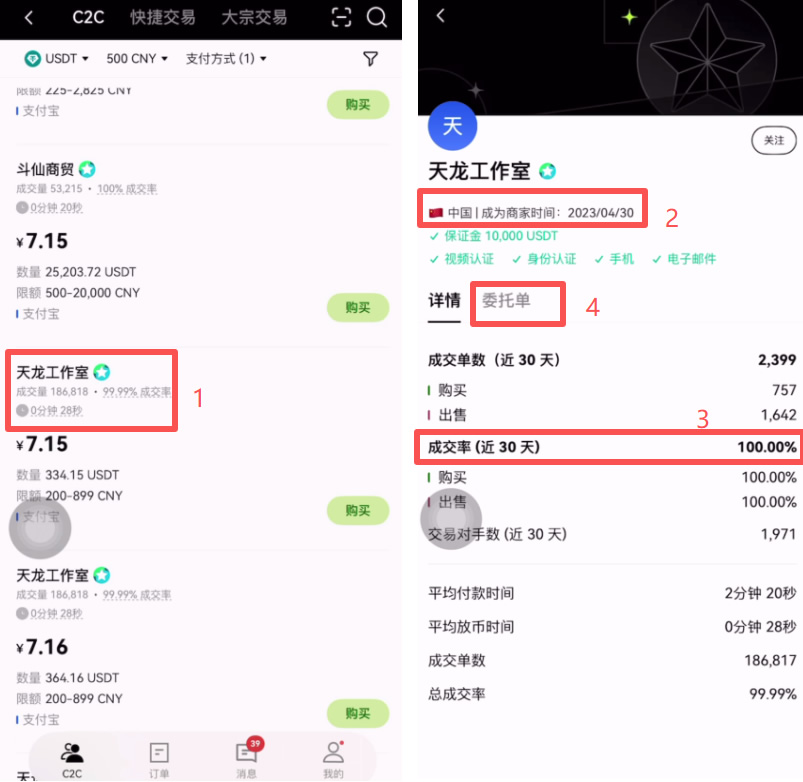

点击这里的【购买】。

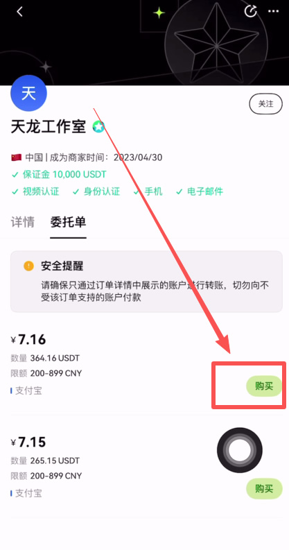

## 2、使用支付宝交易
再次输入一下要购买的金额，然后会自动为我们算出来，我们支付500人民币将收到69.83颗USDT。点击【0手续费购买USDT】。

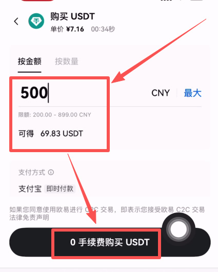

我们点击商家的聊天框，这个商家会给我们提示，告诉我们必须本人实名付款，否则是不会放币的，还告诉我们黑钱要勿扰。然后我们点击【获取付款详情】。

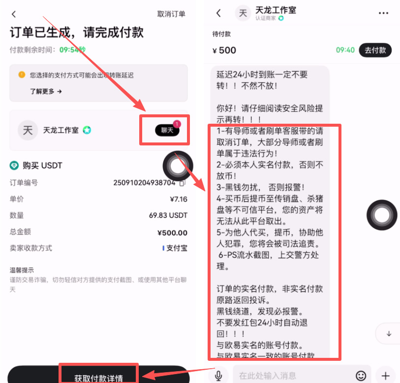

## 3、收到款项
我们根据商家提供的支付方式给对方转钱，转完钱之后点击【我已支付】，然后等商家收到钱之后就会把币打给我们了。

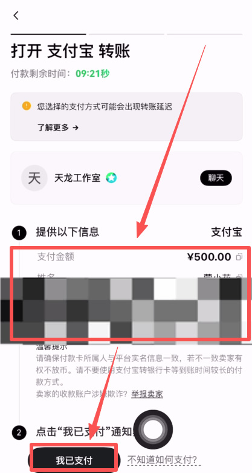

我们购买好的USDT都会在资金账户里面，我们点击右下角的【资产】。

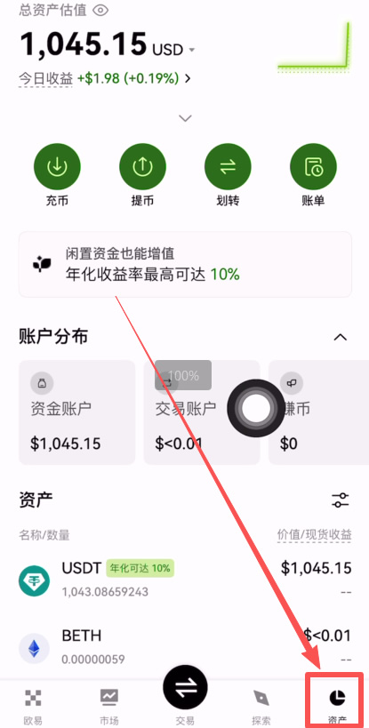

在下方“资产”这里就可以看到我们购买好的USDT了。

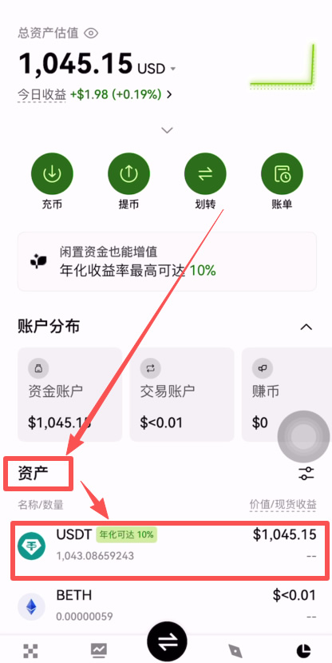

这样你就有了自己真正意义上的数字资产了，而且你可以随意将这些资产转移到任何一个自己的钱包里面。

# 三、欧易C2C出金USDT操作流程

1、我们还是在C2C交易里面，在这里选择【出售】，要出售的币种同样是USDT。你可以筛选一下金额，比如说我想要卖出500人民币的USDT，我就输入500。后面同样可以选择一下你的收款方式，银行卡、支付宝还有微信支付，你可以随便来选择一下。

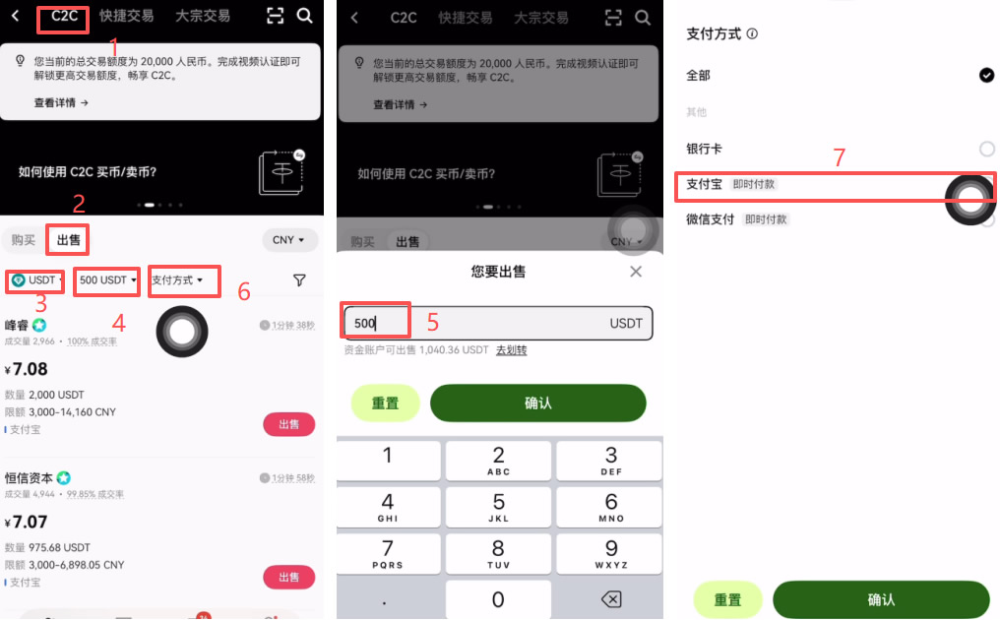

2、接下来我们要点击旁边的小钉子标志，我们在出售的时候一定要勾选这个冻结赔付委托单，点击【确认】。这个会让我们跟商家交易之后，如果我们的收款账户被冻结，商家会给我们赔付的。

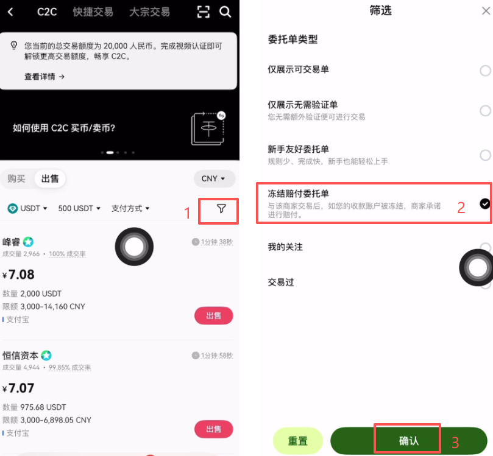

3、勾选完成之后，你会发现他出了很多醒目的绿色标志的商家，这个就是有冻结赔付资质的商家了。我们在出售的时候，不仅要找成交量和成交率高的商家来进行出售，还要找注册时间比较久，平均付款时间在3分钟以内的商家来进行出售。

我们来看一下，比如说“阿鸿商行”这一家，他有一个22万单的成交量，这个比较高。我们再来看一下他的注册时间。点击进去可以看到这个商家的注册时间是在24年的4月，证明这个商家已经注册有两年多了。而且他近30天的成交率也是100%，平均付款时间在2分40秒，这一家就是可以的。我们就可以跟这家来进行出售，点击它旁边的“委托单”。

4、点击【出售】。

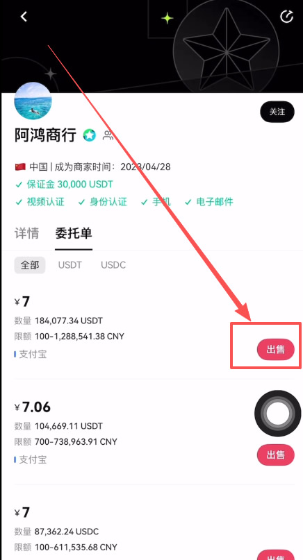

5、输入一下数量，比如说我出售100颗USDT。它下方会自动给我们算出来我出售100颗USDT将收到700人民币。点击下方的【0手续费出售USDT】。

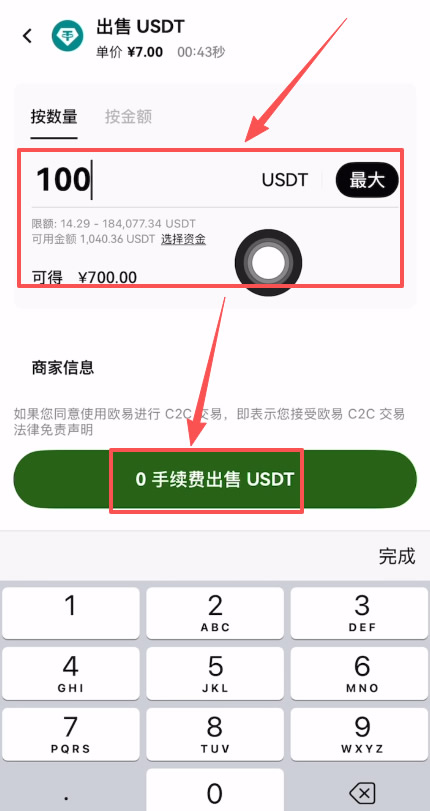

之后这个商家会给我们打钱，这时候大家一定要注意。非商家本人KYC给你转账的，一概要拒绝和他们交易。比如他说自己的账户限额，他用他老婆、亲戚的账户给你转钱的一概要拒绝。当我们已经收到卖家完成付款的提醒之后，不要去盲目的相信短信的提醒。一定要认准自己账户里的实际资产变动，去确认一下真的收到钱了，再点击确认收款的按钮，这样我们才可以把USDT放行给买家。这就是我们一整个出金的流程了。

# 总结
这一篇文章我们完成了从0开始在欧易中购买USDT，整个过程花费不到5分钟。也讲到了买卖过程中的一些注意事项，就是做好自己的风险管控，防止触发风控导致自己的账号受限。

