import OKXCard from '@/components/OKXCard.astro';

欧易（OKX）凭借其强大的功能、友好的界面和一流的安全措施，一直是许多资深交易者的首选工具。无论是现货积累财富，还是合约进行高效套利，都能得心应手。

本文为中国大陆用户提供OKX欧易App现货、合约交易的全流程操作说明

# 一、准备工作
在欧易进行现货以及合约的交易，首先需要一个欧易的账号，以及准备好usdt/usdc，因为在加密货币的世界里，进行比特币/以太坊或者其它的交易对交易几乎都是通过usdt/usdc进行交易

1. ### 欧易开户教程：
   - #### 图文教程：[欧易开户教程：全程带你完成注册与App下载步骤](/posts/okx-register-tutorial-2026.02.25/)
   - #### 视频教程：[这里写视频标题](视频链接)

2. ### 欧易c2c买卖usdt：
   -  #### 图文教程：[新手买USDT全流程教学：欧易OKX C2C安全买币攻略与避坑指南](/posts/okx-register-tutorial-2026.02.25/)
   - #### 视频教程：[这里写视频标题](视频链接)

3. ### 欧易现货与合约交易
   - #### 视频教程： [这里写视频标题](视频链接)

<OKXCard />

# 二、现货交易教程（低风险，适合新手）
现货交易即直接买卖加密货币，盈利来自价格涨跌，无杠杆风险。

 操作步骤：

1、打开欧易App([官方注册](https://bn1688.cc/okx))，点击下方中间的【交易】按钮，在上方这里可以搜索我们想要购买的币种，比如说我们想要购买比特币，就搜索“BTC”，选择“BTC/USDT”的交易对，就是我们使用USDT去兑换比特币。

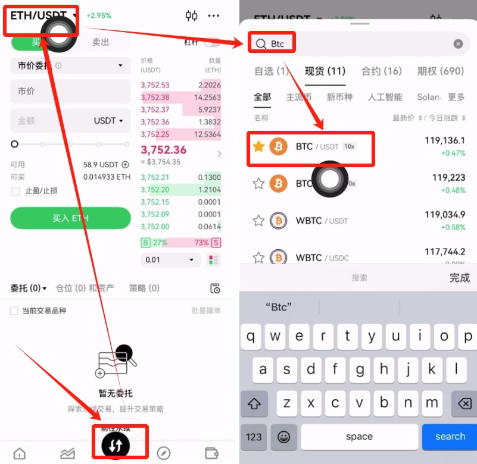

2、选择“买入”，这里有市价委托和限价委托。“限价委托”就是你可以设置一个价格，当市场达到你设置的价格的时候才能够成交，当然这个是需要我们去等的。“市价委托”就以他会以当前市场最优惠的价格直接买入或者是卖出。

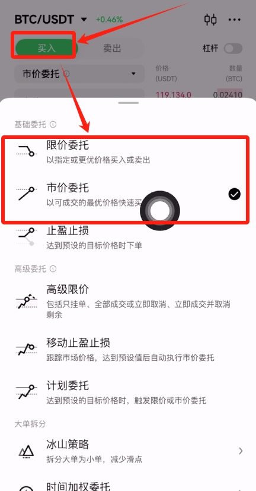

3、我们就可以选择这个市价委托，因为他不用等。然后输入你想要购买的金额，点击【买入BTC】。

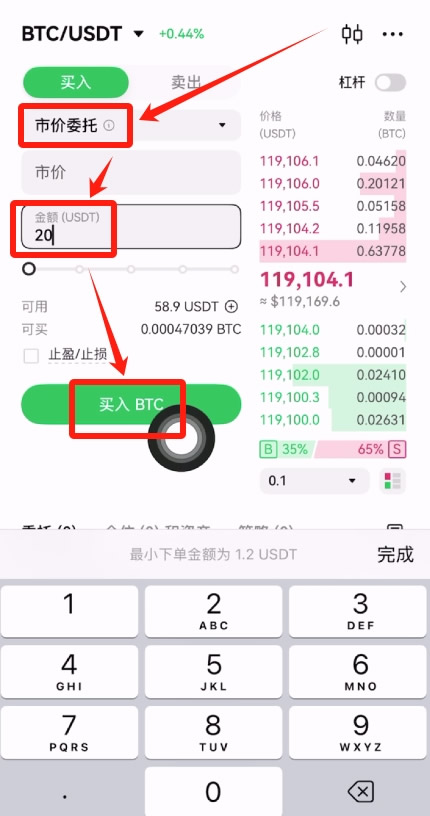

4、点击【确认】。直接就下单成功了。

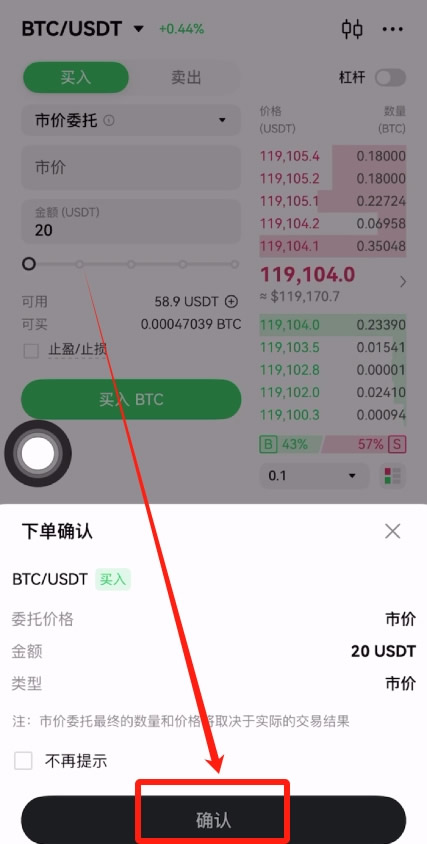

5、然后你可以点击右下角的资产，选择“交易账户”，在这里就可以看到我们购买好的比特币了。我们把比特币放在OKX这类的大交易所是很安全的，大家不用担心。

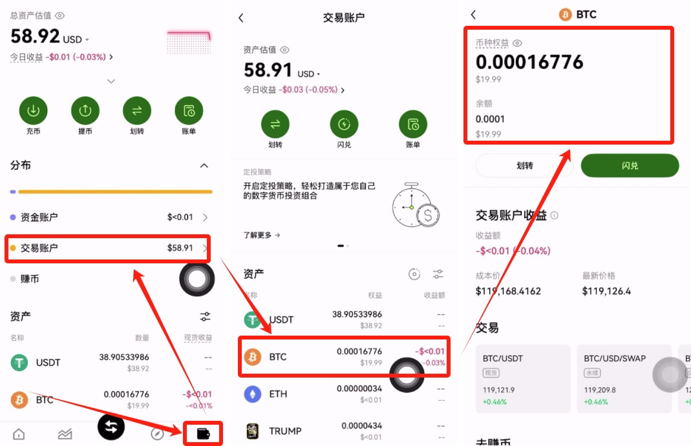

下面进行OKX合约交易的讲解。

# 三、合约交易教程（高风险，谨慎参与）
合约交易可双向交易（做多 / 做空）并使用杠杆，收益与风险同步放大。

打开欧易App([官方注册](https://bn1688.cc/okx))，点击下方中间的【交易】，再次点击一下，选择【合约】。

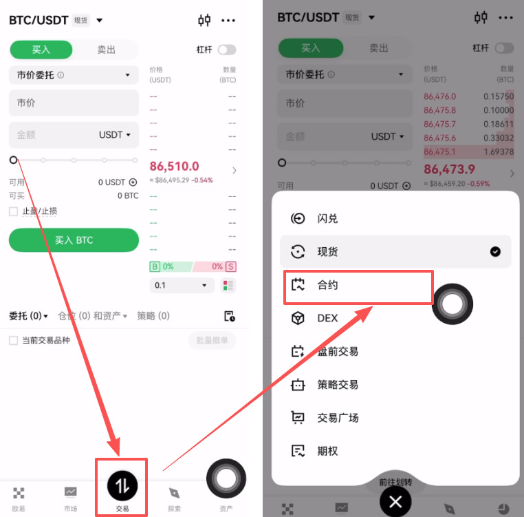

进来之后我们可以先来选择一下要交易的币种。比如说我们就想做比特币的合约，就可以选择BTCUSDT永续合约。

其他的币种你都可以在这里来进行搜索。

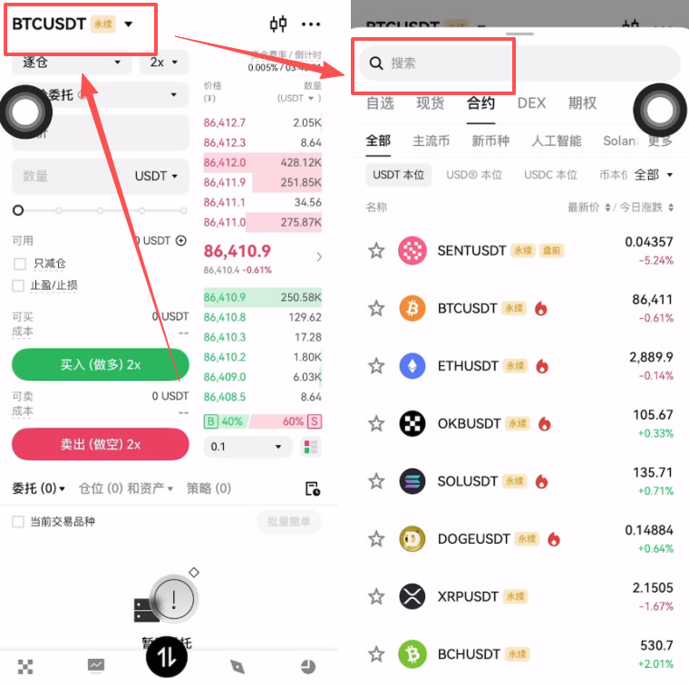

下方可以选择全仓或者是逐仓。

“逐仓”就是开多少保证金，一旦爆仓之后不会牵连账户里面其他的资金。

“全仓”就是你钱包里面所有的资金当做你的保证金，所以你有可能会损失掉你钱包里面的所有的资金。一般我们都选择逐仓。

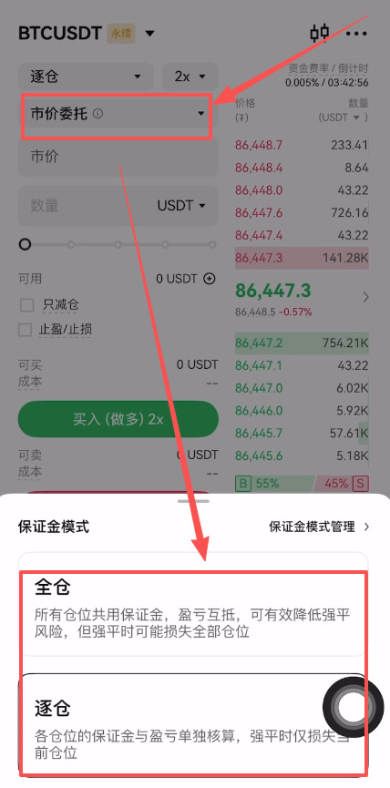

旁边的2X就是杠杆，最高是可以开到100倍杠杆的，我们一般都是开到2-3倍，这里我就开2倍。

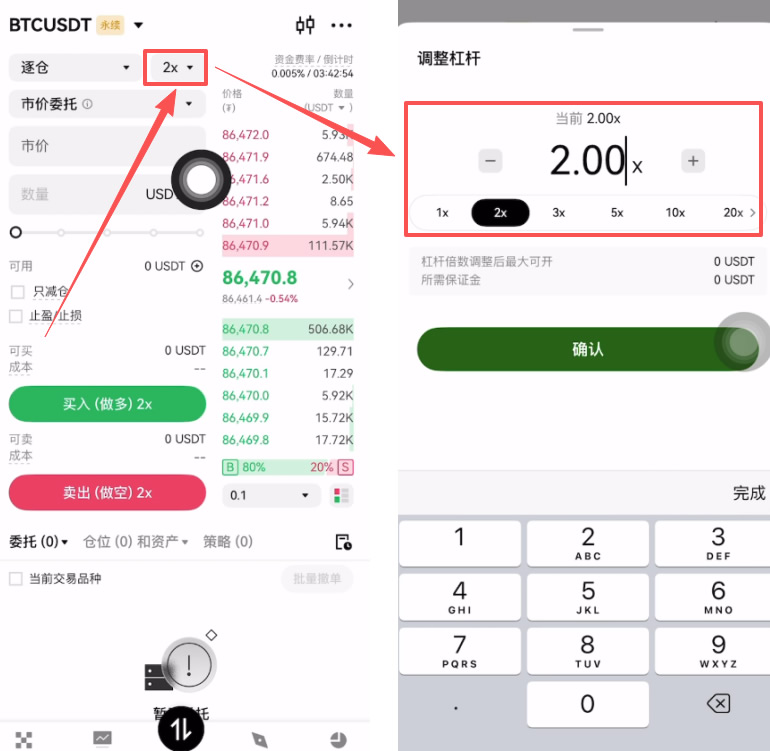

然后你可以选择市价委托或者是限价委托。“限价委托”就是我们可以设置价格，“市价委托”就是可以直接成交。比如说我就选择市价委托，因为可以快速成交。

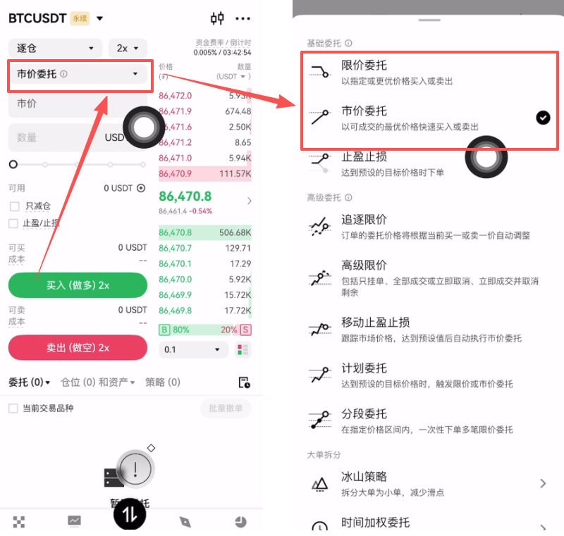

然后你输入要购买的数量，可以看到我这里没有USDT，我先划转一点USDT进来。

从资金账户到交易账户，币种选择USDT，输入划转的金额，点击【确定】。

可以看到现在我们就有了资金了，然后输入一下数量，想做空就点击卖出做空，想做多就点击买入做多。点击【确认】。

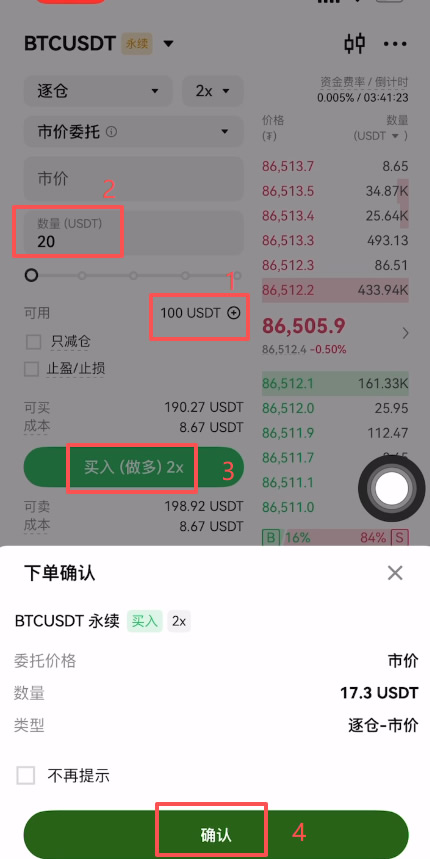

我们在下方都是可以来查看的，如果你不想玩就可以点击这里的【一键平仓】，这样就帮我们把单子全都平掉了。

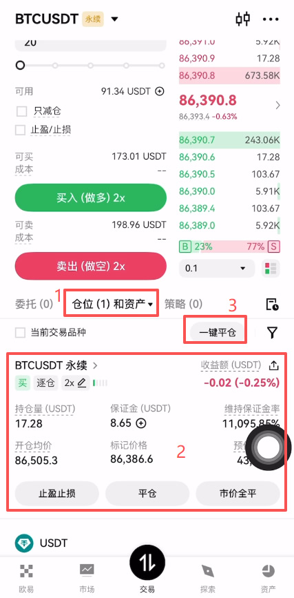

# 四、现货 vs 合约核心区别

<table style="width: 100%; border-collapse: collapse; font-family: sans-serif; font-size: 14px; background: #fff;">
  <thead>
    <tr style="background-color: #f6f8fa; border-bottom: 2px solid #eee;">
      <th style="padding: 12px; text-align: left; color: #888; font-weight: 600; width: 25%;">对比维度</th>
      <th style="padding: 12px; text-align: left; color: #000; font-weight: 800;">现货交易</th>
      <th style="padding: 12px; text-align: left; color: #000; font-weight: 800;">合约交易</th>
    </tr>
  </thead>
  <tbody>
    <tr style="border-bottom: 1px solid #f0f0f0;">
      <td style="padding: 12px; font-weight: bold; background: #fafafa;">杠杆机制</td>
      <td style="padding: 12px;">无杠杆，本金 1:1 交易</td>
      <td style="padding: 12px;">1-125 倍杠杆，收益放大</td>
    </tr>
    <tr style="border-bottom: 1px solid #f0f0f0;">
      <td style="padding: 12px; font-weight: bold; background: #fafafa;">风险程度</td>
      <td style="padding: 12px; color: #0ca678;">低（最大亏损为本金）</td>
      <td style="padding: 12px; color: #e63946;">极高（可能爆仓归零）</td>
    </tr>
    <tr style="border-bottom: 1px solid #f0f0f0;">
      <td style="padding: 12px; font-weight: bold; background: #fafafa;">交易方向</td>
      <td style="padding: 12px;">仅能做多（低买高卖）</td>
      <td style="padding: 12px;">可做多 / 做空（双向盈利）</td>
    </tr>
    <tr style="border-bottom: 1px solid #f0f0f0;">
      <td style="padding: 12px; font-weight: bold; background: #fafafa;">适合人群</td>
      <td style="padding: 12px;">新手 / 长期投资者</td>
      <td style="padding: 12px;">资深 / 高风险承受者</td>
    </tr>
  </tbody>
</table>

