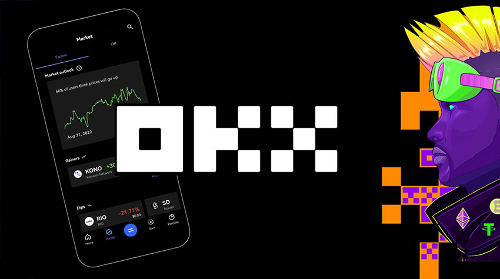
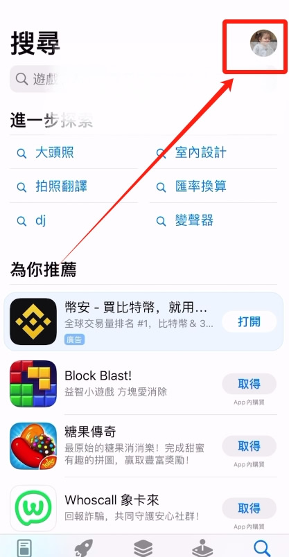
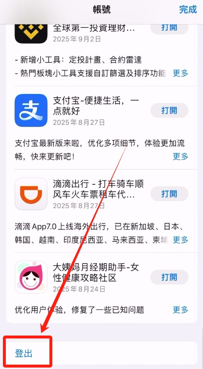
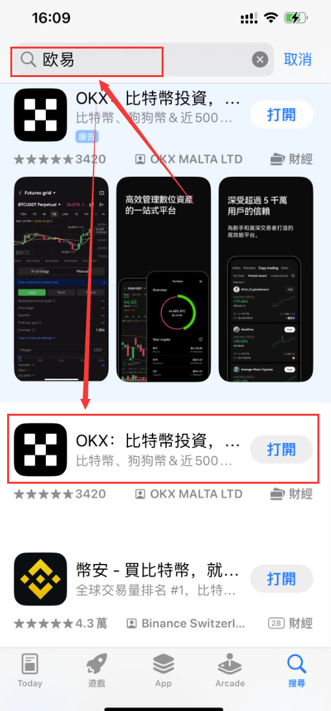

import OKXCard from '@/components/OKXCard.astro';

    

        <strong style="color: #000; font-size: 18px;">欧易（OKX）</strong> 作为全球领先的加密货币交易所之一，以其丰富的币种、强大的功能和良好的流动性吸引了大量用户。然而，对于广大的苹果 <strong>iPhone</strong> 用户而言，下载和安装欧易 App 却成了一个不小的难题。本文将为您提供一份详尽、安全、一步步的下载流程指南，需要的朋友可以参考下。
    

在数字资产日益普及的时代，欧易（OKX）已成为众多用户信赖的平台。然而，许多国内苹果用户常常面临无法在 App Store 搜索到“欧易”App 的困扰。这篇文章将详细介绍如何在IOS苹果手机上成功下载安装欧易App，中国大陆用户可以参考学习一下。

# 一、OKX是什么？为什么选择OKX交易？
OKX（欧易）成立于2017年，是全球领先的加密货币交易平台之一，总部位于马耳他。它为全球用户提供包括现货交易、期货交易交易、期权交易、杠杆交易、法币交易等多种交易产品，并支持上百种数字货币及其交易对。凭借其强大的技术支持、透明的交易环境和高流动性，OKX在全球范围内吸引了大量的数字货币交易者。

OKX的特点包括：

交易费用低：OKX提供了最低的交易费用，并且通过持有平台的初始币OKB，用户可以进一步享受手续费折扣。

丰富的交易品种：OKX提供超过200种加密货币交易对，包括比特币、以太坊、安币等主流币种，同时支持各种衍生品交易如期货、永续合约等。

安全保障：OKX采取了高等级的安全措施，包括冷钱包存储、双重身份验证（2FA）等手段，确保用户资金的安全。

全球化支持：OKX支持多语言和法币交易，满足全球用户的不同需求，特别适合多国用户进行跨境交易。

<OKXCard />

# 二、为什么国内App Store搜不到欧易OKX？
由于政策原因，地区的Apple ID默认屏蔽了某些相关App，包括OKX欧易。

因此，国内用户需要通过一些方法才能顺利下载安装：

# 三、准备工作
由于国内的政策原因，默认是屏蔽了加密货币相关的APP，因此你需要重新注册一个海外的Apple ID来进行下载  【推荐：中国台湾、中国香港的ID】
- 海外苹果ID注册教程：[【2025 美区Apple ID最新注册教程，无需信用卡，大陆手机号、一次成功】](https://www.bilibili.com/video/BV1fzSEBGEen/?share_source=copy_web&vd_source=da8d06430c55e31ec1a52eec07c6fd06)

- 如果注册不成功，可以直接购买成品ID：[账号星球](https://accboyllafx.acceboy.com/) 

#### 注意：不建议在网上找共享ID进行下载，有锁机的风险！

# 四、手机AppStore登录Apple ID
海外的Apple ID注册/购买成功后，打开Appstore，在右上角点击我们的头像。把我们原来中国大陆的Apple ID退出登录，因为它是搜不到币安APP的。

往下捯，点击【登出】。

然后我们再输入进我们购买好的台区的apple ID和密码，点击【登入】。

# 五、在AppStore里搜索欧易并下载
登录成功之后，这样就可以在AppStore里搜到币安和欧易APP了。

### 拓展教程：
1. ### 欧易开户教程：
   - #### 图文教程：[欧易开户教程：全程带你完成注册与App下载步骤](/posts/okx-register-tutorial-2026.02.25/)
   - #### 视频教程：[这里写视频标题](视频链接)

2. ### 欧易c2c买卖usdt：
   - #### 图文教程：[新手买USDT全流程教学：欧易OKX C2C安全买币攻略与避坑指南](/posts/okx-register-tutorial-2026.02.25/)
   - #### 视频教程：[这里写视频标题](视频链接)

3. ### 欧易现货与合约交易
   - #### 图文教程：[OKX欧易App现货与合约交易完整操作步骤教程](/posts/okx-xianhuoheyue-2026.02.26/)
   - #### 视频教程： [这里写视频标题](视频链接)

# 如何识别官方正版欧易 App？
名称：OKX

开发商：OKX MALTA LTD

图标：黑底白字「OKX」Logo

网址说明：官网地址为 [https://www.okx.com](https://bn1688.cc/okx)

# 常见问题解答
Q1：我改了区域还是搜索不到？

A：请确认是否已退出并重新登录 Apple ID，有时需重启 App Store。

Q2：海外 ID 没有信用卡怎么办？

A：可选择“无”付款方式，或者使用地址。

Q3：欧易是否安全？

A：欧易是全球合规平台，拥有1:1储备审计，资产安全有保障。

# 总结
如果你正在寻找“如何下载欧易App”或“iOS版OKX下载方法”，这篇指南可以帮助你快速掌握下载技巧。通过修改区域或创建新 ID，就能顺利在iPhone或iPad上获取欧易官方App，开启你的加资之旅。

以上就是欧易苹果版APP如何下载？欧易iOS最新版APP下载教程的详细内容，

